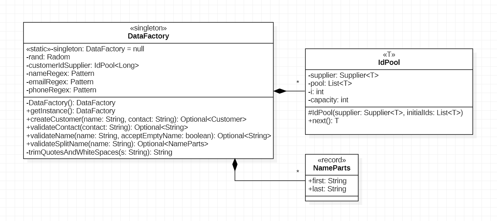
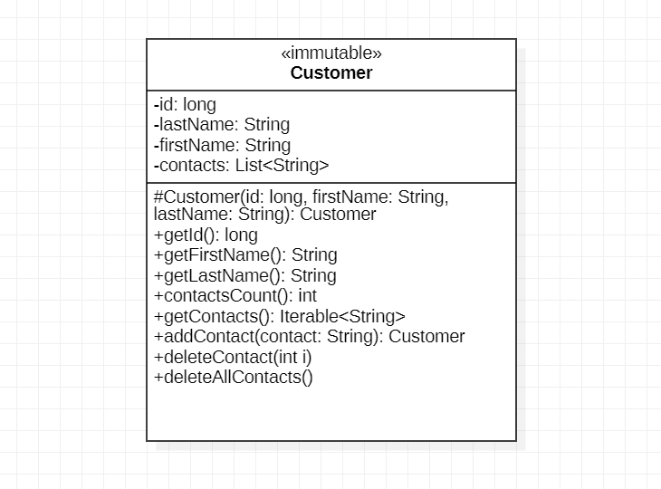

# C4: *DataFactory*

The assignment demonstrates two basic
[Software Design Patterns](https://refactoring.guru/design-patterns):
*Singleton* and *Factory*.

- A new class *DataFactory* centralizes the creation of objects of classes
    from package `datamodel`, e.g. of class *Customer*.

- *DataFactory* implements the *"lazy"*
    [*Singleton*](https://en.wikipedia.org/wiki/Singleton_pattern)
    pattern and provides
    [*Factory*](https://refactoring.guru/design-patterns/factory-method)
    methods for the creation of *Customer* objects.

- *Customer* objects can no longer be created with *new*. *DataFactory*
    will be used instead.

The change allows restructuring class *Customer* into an *immutable* class,
which means its attributes can no longer be changed.

Steps:

1. [Create a Singleton Class: *DataFactory*](#1-create-a-singleton-class-datafactory)
1. [Immutalize Class *Customer*](#2-immutalize-class-customer)
1. [Run Driver Code](#3-run-driver-code)
1. [Update JUnit-Tests](#4-update-junit-tests)
1. [Commit and Push Changes](#5-commit-and-push-changes)


&nbsp;

## 1. Create a Singleton Class: *DataFactory*

Creating objects of *data classes* from the package `datamodel` with *new()*
(constructors) has disadvantages:

- objects can be created with invalid attributes, e.g. Customer objects
    with *name:* `null` or *name:* `""`,

- uniqueness of *id* attributes cannot be guaranteed across objects,

- *data classes* contain logic, e.g. the separation of single-String names
    into first- and last name attributes.

Furthermore, attributes of objects of *data classes* should not arbitrarily
be modified after creation, e.g. names set to null: *setName(null)*.

A common approach to address these problems is to centralize *object creation*
at a central place: `DataFactory.java`.

- The class exists as a *singleton*, which means at most one instance of this
    class will exist. This is indicated in the UML class diagram by stereotype:
    `<<singleton>>`.

- *DataFactory* includes automatic generation of *Customer* *id* attributes,
    which are managed in an `IdPool<T>` that assumes some initially provided *id*
    and then expands as *id* are consumed by newly created *Customer* objects.

    *IdPool* is of a generic type `<T>` taking into account that later classes
    will use `String` and `Long` values for *id*.

- Furthermore, splitting of single-String names, e.g. `"Eric Meyer"` into
    last name: `"Meyer"` and first name: `"Eric"` has been moved out of class
    *Customer* into mathod: `Optional<NameParts> validateSplitName(name String)`.
    This method return a valid pair of *first* and *last name* parts, if the input
    *name* could sucessfully be split and name parts are valid. Only then, a
    `NameParts` object is returned in the `Optional<NameParts>`.

The UML Class Diagram shows the new *DataFactory* class with associated inner
class: *IdPool* and Record *NameParts:*




Create a class `DataFactory.java` in the package `datamodel` such that it:

1. implements the *"lazy"* [*Singleton*](https://en.wikipedia.org/wiki/Singleton_pattern)
    pattern with a public accessor method:

    ```java
    /**
     * Static accessor method to {@link DataFactory} <i>Singleton</i> instance.
     * @return singleton {@link DataFactory} instance
     */
    public static DataFactory getInstance() { ... }
    ```

1. implements the [*Factory*](https://refactoring.guru/design-patterns/factory-method)
    for the creation of *Customer* objects. Factory methods centralize
    *id*-generation and validate parameters: *name*, *contact*.
    
    A *Customer* object is only created if parameters are valid. If no object can
    be created, an empty *Optional* is returned:

    ```java
    /**
     * <i>Factory</i> method to create an object of class {@link Customer}
     * from validated parameters. The <i>id</i> attribute is internally
     * provided. No object is created when arguments are not valid.
     * @param name single-String name parameter, invalid if null or empty,
     *          example: "Eric Meyer" or "Meyer, Eric"
     * @param contact contact parameter validated as an email address
     *          containing '@' or a phone number, invalid if null or empty
     * @return created {@link Customer} object with valid parameters or empty
     */
    public Optional<Customer> createCustomer(String name, String contact) {
        var nameParts = validateSplitName(name);
        if(nameParts.isPresent()) {
            long id = customerIdSupplier.next();
            var validContact = validateContact(contact);
            if(validContact.isPresent()) {
                // only create Customer when all conditions are met
                Customer c = new Customer(id, nameParts.get().first(), nameParts.get().last());
                c.addContact(validContact.get());
                return Optional.of(c);
            }
        }
        return Optional.empty();
    }
    ```

1. Supplement class `DataFactory.java` with code for the generation of unique *id's*:

    ```java
    /*
    * Static {@link DataFactory} <i>Singleton</i> instance (<i>lazy</i> pattern).
    */
    private static DataFactory singleton = null;

    /*
    * Random generator.
    */
    private final Random rand = new Random();

    /*
    * Supplier for {@link Customer} id of 6-digit random numbers.
    */
    private IdPool<Long> customerIdSupplier = new IdPool<>(
        () -> 100000L + rand.nextLong(900000L),
        Arrays.asList(  // initial Customer ids
            892474L, 643270L, 286516L, 412396L, 456454L, 651286L
        )
    );

    /**
     * Internal class to manage pool of unique {@code ids} of type {@code T}.
     */
    private class IdPool<T> {
        private final Supplier<T> supplier; // supplier for id's of type {@code T}
        private final List<T> pool; // pool of used or available id
        private int i=0;            // [0..i-1]: used id, [i..cap-1]: available id
        private int capacity;       // pool capacity

        /**
         * Constructor of id pool of {@code T}.
         * @param supplier external supplier of id to fill the pool
         * @param initialIds id to initialize the pool
         */
        IdPool(Supplier<T> supplier, List<T> initialIds) {
            this.supplier = supplier;
            this.pool = new ArrayList<>(Optional.ofNullable(initialIds).orElse(List.of()));
            this.capacity = this.pool.size();
        }

        /**
         * Return next id from the pool, resupply pool if capacity is exceeded.
         * @return next id of type {@code T}
         */
        T next() {
            if(i >= capacity) {  // add 10 supplied ids to the pool
                capacity += Stream.generate(supplier)
                        .filter(n -> ! pool.contains(n))
                        .limit(10)
                        .peek(n -> pool.add(n))
                        .count();
            }
            return pool.get(i++);
        }
    }
    ```

1. Supplement class `DataFactory.java` with regular expressions for
    *name* and *contact* validation:

    ```java
    /*
    * Regular expression to validate a name or name parts. A valid
    * name must start with a letter, followed by a combination of
    * letters, "-", "." or white spaces. Valid names are: "E", "E.",
    * "Eric", "Ulla-Nadine", "Eric Meyer", "von-Blumenfeld".
    * Names do not include numbers or other special characters.
    * For the use of regular expressions, see
    * https://stackoverflow.com/questions/8204680/java-regex-email
    */
    private final Pattern nameRegex =
        Pattern.compile("^[A-Za-z][A-Za-z-\\s.]*$");

    /*
     * Regular expression to validate an email address.
     */
    private final Pattern emailRegex =
        Pattern.compile("^[a-z0-9._%+-]+@[a-z0-9.-]+\\.[a-z0-9_]+$", Pattern.CASE_INSENSITIVE);

    /*
     * Regular expression to validate a phone or fax number.
     */
    private final Pattern phoneRegex =
        Pattern.compile("^(phone:|fax:|\\+[0-9]+){0,1}\\s*[\\s0-9()][\\s0-9()-]*", Pattern.CASE_INSENSITIVE);
    ```

1. Supplement class `DataFactory.java` with code for contact validation:

    ```java
    /**
     * Validate contact for acceptable email address or phone number and
     * return contact or empty result.
     * <br>
     * The validation rule for an <i>email address</i> is defined by a
     * regular expression:
     *      {@code "^[a-z0-9._%+-]+@[a-z0-9.-]+\\.[a-z0-9_]+$"}.
     * <br>
     * The vaidation rule for an <i>phone number</i> is defined by:
     *      {@code "^(phone:|fax:|\\+[0-9]+){0,1}\\s*[\\s0-9()][\\s0-9()-]*"}.
     * <br>
     * Leading and traling whitespaces and quotes are trimmed from contact
     * before validation.
     * @param contact contact to validate
     * @return possibly modified (e.g. dequoted, trimmed) valid contact or empty result
     */
    public Optional<String> validateContact(String contact) {
        if(contact != null) {
            var cont = trimQuotesAndWhiteSpaces(contact);
            final int minLength = 6;
            boolean valid = cont.length() >= minLength;
            if(valid && (
                emailRegex.matcher(cont).matches() ||
                phoneRegex.matcher(cont).matches()
            )) {
                return Optional.of(cont);
            }
        }
        return Optional.empty();
    }
    ```

1. Supplement class `DataFactory.java` with code for splitting single-String
    names (e.g. `"Eric Meyer"`) into first and last names (first: `"Eric"`,
    first: `"Meyer"`) with name validation:

    ```java
    /**
     * Validate name and return name or empty result. A valid name must
     * start with a letter, followed by a combination of letters, "-",
     * "." or white spaces. Valid names are: "E", "E.", "Eric",
     * "Ulla-Nadine", "Eric Meyer", "von-Blumenfeld".
     * Names do not include numbers or other special characters.
     * <br>
     * The validation rule for a <i>name</i> is defined by a regular
     * expression:
     *      {@code "^[A-Za-z][A-Za-z-\\s.]*$"}.
     * Leading and traling whitespaces and quotes are trimmed from name
     * before validation.
     * 
     * @param name name to validate
     * @param acceptEmptyName accept empty ("") name, e.g. as first name
     * @return possibly modified (e.g. dequoted, trimmed) valid name or empty result
     */
    public Optional<String> validateName(String name, boolean acceptEmptyName) {
        if(name != null) {
            name = trimQuotesAndWhiteSpaces(name);
            if(nameRegex.matcher(name).matches() || (name.length()==0 && acceptEmptyName))
                return Optional.of(name);
        }
        return Optional.empty();
    }

    /**
     * Record of a name with first and last name parts.
     * @param first first name parts
     * @param last last name parts
     * @hidden exclude from documentation
     */
    public record NameParts(String first, String last) { }

    /**
     * Split single-String name into first and last name parts and
     * validate parts, e.g. "Meyer, Eric" is split into first: "Eric"
     * and last name: "Meyer". Both parts are validated by method
     * {@link validateName}().
     * @param name single-String name
     * @return record with validated first and last name parts
     */
    public Optional<NameParts> validateSplitName(String name) {
        if(name != null && name.length() > 0) {
            String first="", last="";
            String[] spl1 = name.split("[,;]");
            if(spl1.length > 1) {
                // two-part name with last name first
                last = spl1[0];
                first = spl1[1];
            } else {
                // no separator [,;] -> split by white spaces;
                for(String s : name.split("\\s+")) {
                    if(last.length() > 0) {
                        // collect firstNames in order and lastName as last
                        first += (first.length()==0? "" : " ") + last;
                    }
                    last = s;
                }
            }
            var lastName = validateName(last, false);
            if(lastName.isPresent()) {
                var firstName = validateName(first, true);
                if(firstName.isPresent()) {
                    return Optional.of(new NameParts(firstName.get(), lastName.get()));
                }
            }
        }
        return Optional.empty();
    }

    /**
     * Trim leading and trailing white spaces, commata {@code [,;]} and
     * quotes {@code ["']} from a String.
     * @param s String to trim
     * @return trimmed String
     */
    private String trimQuotesAndWhiteSpaces(String s) {
        s = s.replaceAll("^[\\s\"',;]*", "");   // trim leading white spaces[\s], commata[,;] and quotes['"]
        s = s.replaceAll( "[\\s\"',;]*$", "");  // trim trailing white spaces[\s], commata[,;] and quotes['"]
        s = s.replaceAll( "[\\s]+", " ");       // remove white spaces sequences, "Eric  Meyer" -> "Eric Meyer"
        return s;
    }
    ```


&nbsp;

## 2. Immutalize Class *Customer*

An *immutable* class *Customer* does not allow changes to attributes.
*DataFactory* is the only class that can create new *Customer*
objects from validated parameters.

Making class *Customer* immutable means:

1. Make all attributes: `private` and `final`.

1. Remove *setter()* methods.

1. Remove all constructors, except one used by *DataFactory* with
    visibility: `protected` to prevent creation of *Customer*
    objects from other packages.

The remaining class has no *setter()* methods and hence is called *immutable*,
which is shown in the UML class diagram by stereotype: `<<immutable>>`.




```java
/**
 * Immutable entity class representing a <i>Customer</i>, a person who creates
 * and holds (owns) orders in the system.
 * <br>
 * An <i>immutable</i> class does not allow changes to attributes.
 * {@link DataFactory} is the only class that creates {@link Customer}
 * objects from validated arguments.
 * 
 * @version <code style=color:green>{@value application.package_info#Version}</code>
 * @author <code style=color:blue>{@value application.package_info#Author}</code>
 */
public final class Customer {

    /**
     * Unique Customer id attribute. Must be {@code > 0}).
     */
    private final long id;

    /**
     * Customer surname attribute. Must not be {@code null} and not empty {@code ""}.
     */
    private final String lastName;

    /**
     * Customer none-surname parts. Must not be {@code null}, can be empty {@code ""}.
     */
    private final String firstName;

    /**
     * Contact information with multiple entries, e.g. email addresses
     * or phone numbers. The attribute is exposed to {@link DataFactory}
     * in the same package.
     */
    private final List<String> contacts = new ArrayList<>();


    /**
     * None-public constructor used by {@link DataFactory} preventing object
     * creation outside this package.
     * @param id customer identifier supplied by {@link DataFactory}
     * @param firstName first name attribute, must not be {@code null}, can be empty {@code ""}
     * @param lastName last name attribute, must not be {@code null} and not empty {@code ""}.
     * @throws IllegalArgumentException if {@code id} is negative, firstName is {@code null}
     *      or lastName is {@code null} or empty {@code ""}
     */
    protected Customer(long id, String firstName, String lastName) {
        if(id < 0L)
            throw new IllegalArgumentException("id negative");
        if(lastName==null || lastName.length()==0)
            throw new IllegalArgumentException("lastName null or empty");
        //
        this.id = id;
        this.firstName = firstName;
        this.lastName = lastName;
    }

    /**
     * Id attribute getter.
     * @return customer id
     */
    public long getId() {
        return id;
    }

    /**
     * LastName attribute getter.
     * @return value of lastName attribute
     */
    public String getLastName() {
        return lastName;
    }

    /**
     * FirstName attribute getter.
     * @return value of firstName attribute
     */
    public String getFirstName() {
        return firstName;
    }

    /**
     * Return the number of contacts.
     * @return number of contacts
     */
    public int contactsCount() {
        return contacts.size();
    }

    /**
     * Contacts getter (as immutable {@link Iterable<String>}).
     * @return contacts (as immutable {@link Iterable<String>})
     */
    public Iterable<String> getContacts() {
        return contacts;
    }

    /**
     * Add new contact validated through {@link DataFactory}. Method has
     * no effect if contact is not valid.
     * @param contact contact added validated through {@link DataFactory}
     * @return chainable self-reference
     */
    public Customer addContact(String contact) {
        DataFactory.getInstance().validateContact(contact)
            .filter(cont -> ! contacts.contains(contact))
            .ifPresent(c -> ((List<String>)contacts).add(c));
        return this;
    }

    /**
     * Delete the i-th contact with {@code i >= 0} and {@code i < contactsCount()}.
     * Method has no effect for {@code i} outside valid bounds.
     * @param i index of contact to delete
     */
    public void deleteContact(int i) {
        if( i >= 0 && i < contacts.size() ) {
            contacts.remove(i);
        }
    }

    /**
     * Delete all contacts.
     */
    public void deleteAllContacts() {
        contacts.clear();
    }
}
```


&nbsp;

## 3. Run Driver Code

Compare the previous method of creating *Customer* objects using *new*
in *Application_C2.java*:

```java
/**
 * Method of the {@link Runtime.Runnable} interface called on an instance
 * of this class created by the {@link Runtime}. Program execution starts here.
 * @param properties properties from the {@code application.properties} file
 * @param args arguments passed from the command line
 */
@Override
public void run(Properties properties, String[] args) {

    final Customer eric = new Customer("Eric Meyer")
        .setId(892474L)     // set id, first time
        .setId(947L)        // ignored, since id can only be set once
        .addContact("eric98@yahoo.com")
        .addContact("eric98@yahoo.com") // ignore duplicate contact
        .addContact("(030) 3945-642298");

    final Customer anne = new Customer("Anne Bayer")
        .setId(643270L)
        .addContact("anne24@yahoo.de")
        .addContact("(030) 3481-23352")
        .addContact("fax: (030)23451356");

    final Customer tim = new Customer("Tim Schulz-Mueller")
        .setId(286516L)
        .addContact("tim2346@gmx.de");

    final Customer nadine = new Customer("Nadine-Ulla Blumenfeld")
        .setId(412396L)
        .addContact("+49 152-92454");

    final Customer khaled = new Customer()
        .setName("Khaled Saad Mohamed Abdelalim")
        .setId(456454L)
        .addContact("+49 1524-12948210");

    List<Customer> customers = List.of(eric, anne, tim, nadine, khaled);
    //
    // print customer list
    customers.stream()
        .map(c -> print(c))     // .map(this::print)
        .forEach(System.out::println);
}
```

*Customer* objects can no longer be created directly with *new* causing
compile errors.

The new method of creating *Customer* objects through *DataFactory*
is shown below. Arguments of `createCustomer(...)` are now validated.
In case of invalid arguments, empty Optionals are returned:

```java
/*
 * Reference to {@link DataFactory} singleton.
 */
private final DataFactory dataFactory = DataFactory.getInstance();


/**
 * Method of the {@link Runtime.Runnable} interface called by {@link Runtime}.
 * Program execution starts here.
 * @param properties properties from the {@code application.properties} file
 * @param args arguments passed from the command line
 */
@Override
public void run(Properties properties, String[] args) {
    //
    List<Customer> customers = List.of(
        // 
        dataFactory.createCustomer("Eric Meyer", "eric98@yahoo.com")
            .map(c -> c.addContact("eric98@yahoo.com").addContact("(030) 3945-642298")),
        // 
        dataFactory.createCustomer("Anne Bayer", "anne24@yahoo.de")
            .map(c -> c.addContact("(030) 3481-23352").addContact("fax: (030)23451356")),
        // 
        dataFactory.createCustomer("Schulz-Mueller, Tim", "tim2346@gmx.de"),
        dataFactory.createCustomer("Blumenfeld, Nadine-Ulla", "+49 152-92454"),
        dataFactory.createCustomer("Khaled Saad Mohamed Abdelalim", "+49 1524-12948210"),
        // 
        // attempts to create Customer objects from invalid arguments
        dataFactory.createCustomer("Mandy Mondschein", "locomandy<>gmx.de") // invalid email address, no object is created
            .map(c -> c.addContact("+49 030-3956256")), // and no other (valid) contact is added
        dataFactory.createCustomer("", "nobody@gmx.de")     // invalid name, no object is created
    //
    ).stream()
        .filter(c -> c.isPresent())
        .map(c -> c.get())
        .toList();

    // define table for output
    final TableFormatter tf = new TableFormatter(
            "| %8s ", "| %-32s", "| %-31s |")   // column specification
        .line()
        .row("Kund.-ID", "Name", "Kontakt")     // table header
        .line();

    // fill objects as rows into Customer table
    customers.stream()
        .forEach(c -> {
            String id=String.format("%d", c.getId());
            String name=fmtCustomerName(c, 0);
            String contact=fmtCustomerContacts(c, 1);
            // 
            tf.row(id, name, contact);  // write row into table
        });
    //
    tf.line();

    // print numbers of objects in collections
    System.out.println(String.format(
        "(%d) Customer objects built.\n---",
        customers.size()));

    // print Customer table
    System.out.println(tf.get().toString());
}
```

Fetch the complete driver class
[*Application_C4.java*](https://github.com/sgra64/se1-bestellsystem/blob/markup/c4-datafactory/Application_C4.java)
and install in the `application` package.

Running the program outputs the table of *Customer* objects that could be
created from valid parameters.

```
(5) Customer objects built.
---
+----------+---------------------------------+---------------------------------+
| Kund.-ID | Name                            | Kontakt                         |
+----------+---------------------------------+---------------------------------+
|   892474 | Meyer, Eric                     | eric98@yahoo.com, (+1 contacts) |
|   643270 | Bayer, Anne                     | anne24@yahoo.de, (+2 contacts)  |
|   286516 | Schulz-Mueller, Tim             | tim2346@gmx.de                  |
|   412396 | Blumenfeld, Nadine-Ulla         | +49 152-92454                   |
|   456454 | Abdelalim, Khaled Saad Mohamed  | +49 1524-12948210               |
+----------+---------------------------------+---------------------------------+
```

Modify code to fix *"Mandy Mondschein's"* email to valid: `locomandy@gmx.de`
and print the *Customer* table sorted alphabetically by last name:

```
(6) Customer objects built.
---
+----------+---------------------------------+---------------------------------+
| Kund.-ID | Name                            | Kontakt                         |
+----------+---------------------------------+---------------------------------+
|   456454 | Abdelalim, Khaled Saad Mohamed  | +49 1524-12948210               |
|   643270 | Bayer, Anne                     | anne24@yahoo.de, (+2 contacts)  |
|   412396 | Blumenfeld, Nadine-Ulla         | +49 152-92454                   |
|   892474 | Meyer, Eric                     | eric98@yahoo.com, (+1 contacts) |
|   651286 | Mondschein, Mandy               | locomandy@gmx.de, (+1 contacts) |
|   286516 | Schulz-Mueller, Tim             | tim2346@gmx.de                  |
+----------+---------------------------------+---------------------------------+
```


&nbsp;

## 4. Update JUnit-Tests

*Customer* JUnit Tests no longer compile with the *DataFactory* changes.

Replace tests in: `tests/datamodel`. Download file:
[*c4-datafactory-tests.tar*](https://github.com/sgra64/se1-bestellsystem/blob/markup/c4-datafactory)
to the project directory and replace tests:

```sh
rm -rf tests/datamodel              # remove old tests
tar xvf c4-datafactory-tests.tar    # install new tests
```

Tests compile and run with the new code:

```sh
mk compile compile-tests run-tests
```
```
Test run finished after 486 ms
[        62 tests successful      ]
[         0 tests failed          ]
```


&nbsp;

## 5. Commit and Push Changes

With all tests passing, commit and push changes to your remote repository.

```sh
git commit -m "c4: DataFactory, immutable Customer class, tests update"
git push                        # push new commit to your upstream remote repository
```
