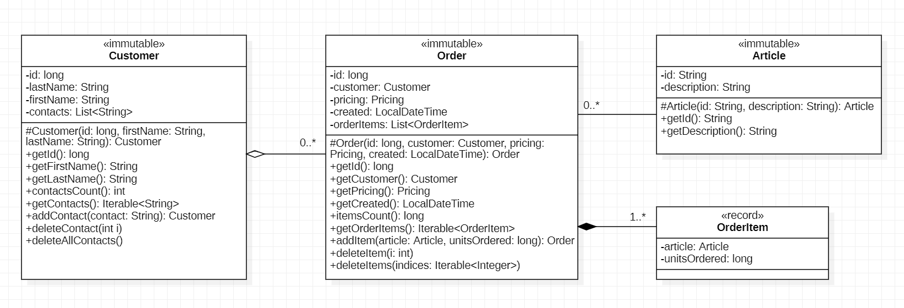
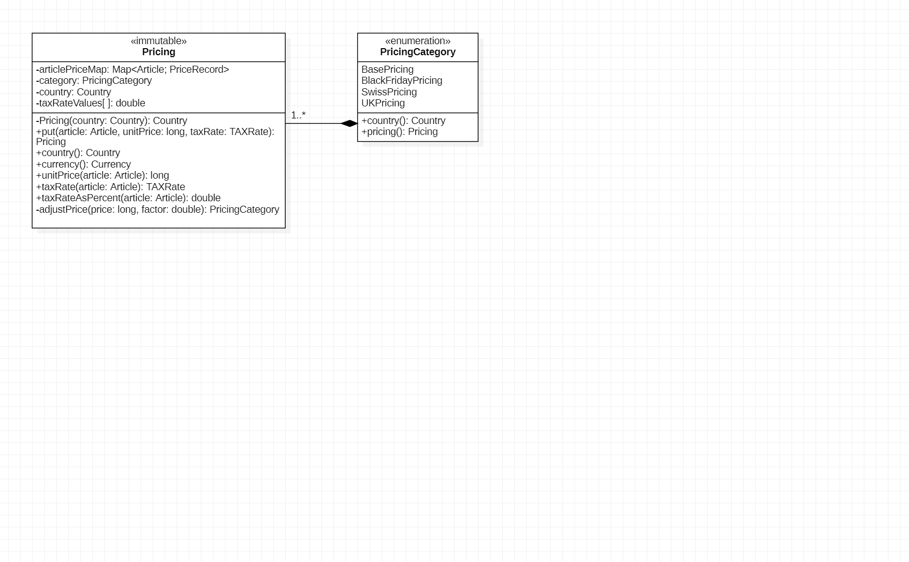

# D1: *DataModel*

<!-- ( [D2: Extended *Pricing*](#d2-extended-pricing) ) -->
[D2: Extended *Pricing*](README_D2.md)

Goal of this assignment is to complete the data model for the *se1-bestellsystem*
by adding classes *Article*, *Order* and *OrderItem*.

The data model is:




Steps:

1. [Create Classes: *Article*, *Order* and *OrderItem*](#1-create-classes-article-order-and-orderitem)
1. [Class *Pricing* (using *Lombok*)](#2-class-pricing-using-lombok)
1. [Extend Class *DataFactory*](#3-extend-class-datafactory)
1. [Write JUnit-Tests](#4-write-junit-tests)
1. [Run Driver Code: *Article* Table](#5-run-driver-code-article-table)
1. [Commit and Push Changes](#6-commit-and-push-changes)


&nbsp;

## 1. Create Classes: *Article*, *Order* and *OrderItem*

Consider the *DataModel* model (UML Class Diagram) carefully and implement classes
*Article*, *Order* and *OrderItem* in package *datamodel*.

- Implement classes *Article* and *Order* as *immutable* classes,
  which means:
    - attributes are *private* and *final*.
    - constructors are *proctected* (only visible in the package *datamodel*).
    - no *setter* methods.

- Implement class *OrderItem* as a public
    [*Record*](https://medium.com/@mak0024/a-comprehensive-guide-to-java-records-2e8edcbd9c75/)
    as *part-of* (*composition*, black diamond) between class *Order* and
    *OrderItem* (inside class *Order*).

- Add Javadoc to classes *Article*, *Order* and *OrderItem*.
    See examples:
    [*Article.html*](https://sgra64.github.io/se1-bestellsystem/d12-datamodel/se1.bestellsystem/datamodel/Article.html),
    [*Order.html*](https://sgra64.github.io/se1-bestellsystem/d12-datamodel/se1.bestellsystem/datamodel/Order.html) and
    [*OrderItem.html*](https://sgra64.github.io/se1-bestellsystem/d12-datamodel/se1.bestellsystem/datamodel/Order.OrderItem.html)
    (disregard methods: *equals(), hashCode(), toString()* that come with the *record* ).

    Add documentation to classes and generate javadoc with: `mk javadoc`.
    Verify results by opening: `docs/index.html` in a browser.


&nbsp;

## 2. Class *Pricing* (using *Lombok*)

Next, a new class *Pricing* is added to package *datamodel* to organize the information
about different pricing models in different countries using different tax rates and
currencies. For example:

- `BasePricing` is a pricing category in Germany using the
    [*Euro*](https://en.wikipedia.org/wiki/Euro)
    (EUR, `€`) as currency with a regular German tax (VAT: value-added tax) rate of *19%*
    and *7%* as reduced rate, e.g. for groceries, books and medical prescriptions.
    Read about the
    [*German VAT (Mehrwertsteuer)*](https://de.wikipedia.org/wiki/Umsatzsteuer_(Deutschland)).

- `SwissPricing` is a pricing category for Switzerland using the
    [*Swiss Franc*](https://en.wikipedia.org/wiki/Swiss_franc)
    (CHF) as currency with tax rates of *8.1%*, *2.6%* (reduced rate)
    and *3.8%* (special rate for accommodation).
    Read about the
    [*Swiss Mehrwertsteuer*](https://de.wikipedia.org/wiki/Mehrwertsteuer_(Schweiz)).

- `UKPricing` is a pricing category for the United Kingdom and Northern Ireland
    using the
    [*Pound Sterling*](https://en.wikipedia.org/wiki/Pound_sterling)
    or the *British Pound* (GBP, £) as currency with tax rates of *20%* and *5%*
    (reduced rate). In addition, there is a *"zero-tax"* rate of *0%* (excempt from tax).
    Read about the [*UK VAT*](https://www.gov.uk/vat-rates).

Furthermore, seasonal discounts are incorporated as pricing categories:
- `BlackFridayPricing` is a pricing category for the main holiday season
    *Nov-Dec* each year offering dicounted prices.

Pricing categories can be extended for more countries or seasonal prices.

Install class *Pricing* into package *datamodel* using code from the
[*Pricing.gist*](Pricing.gist).
A [*"gist"*](https://docs.github.com/en/get-started/writing-on-github/editing-and-sharing-content-with-gists)
is a short code snippet to share with developers on
[*GitHub*](https://en.wikipedia.org/wiki/GitHub).

Re-engineer class *Pricing.java* and draw data structures and their relations
into the diagram below (class *Pricing* and the enum *PricingCategory* are given).
Analyze class *Pricing* and add constructs for:

- *Country* - to represent a country with a currency.

- *Currency* - to represent a currency with a currency code (e.g. *"EUR"*, *"CHF"*
    or *"GBP"*) and corresponding currency symbols, e.g. '€', '₣' and '£'.

- *TAXRate* - tax rates that apply in a country: *regular*, *reduced*, *special*
    (Switzerland) and *excempt* (UK, zero tax).

- *PriceRecord* - a concrete price for an article.

Complete the diagram:




Class *Pricing* uses a technology called
[*Lombok*](https://auth0.com/blog/a-complete-guide-to-lombok/), which avoids
[*"writing boilerplate code"*](https://stackoverflow.com/questions/3992199/what-is-boilerplate-code)
such as *constructors*, *getter* and *setter* methods.
Find out what people understand as *"writing boilerplate code"*.

- Install library [*lombok-1.18.36.jar*](lombok-1.18.36.jar)
    into: `libs/lombok`.

- Add the new library as dependency to *module-info.java:*
    ```java
    // add new dependency to 'module-info.java':
    requires lombok;
    ```

- `wipe` and *re-*`source` the project. Restart *VSCode* to incorporate the new library.

- *Pricing.java* should now compile (see *lombok* imports ).
    Answer questions:
    
    - What is the effect of the `@Getter` annotation?

    - What is the effect of annotation `@Accessors(fluent=true)`?

    - What is a *"fluent"* style of naming *getter* and *setter* methods?

    ```java
    import lombok.AllArgsConstructor;
    import lombok.Getter;
    import lombok.experimental.Accessors;

    @Accessors(fluent=true)
    @Getter
    public class Pricing {

        /**
        * Record stored in {@link articlePriceMap} for an article.
        */
        private record PriceRecord(long unitPrice, TAXRate taxRate) { }

        /**
        * Map of articles with associated {@link PriceRecord}.
        */
        private final Map<Article, PriceRecord> articlePriceMap = new HashMap<>();

        /**
        * Country of this {@link Pricing} instance.
        */
        private final Country country;

        /**
        * Currency associated with this {@link Pricing} instance.
        */
        private final Currency currency;
    }
    ```


&nbsp;

## 3. Extend Class *DataFactory*

Next, methods need to be added to *DataFactory* that create *Article* and
*Order* objects and validate arguments. Recall the methods used in class
*DataFactory* for creating *Customer* objects from the previous assignment
[*c4-datafactory*](../c4-datafactory), see also:
[*DataFactory.html*](https://sgra64.github.io/se1-bestellsystem/c4-datafactory/se1.bestellsystem/datamodel/DataFactory.html)
:

```java
/**
 * DataFactory class from the previous assignment:
 */
public class DataFactory {

    // pool of unique ids for created Customer objects
    private final IdPool<Long> customerIdPool = new IdPool<>( ... );

    // attempt to create new Customer object from validated arguments
    public Optional<Customer> createCustomer(String name, String contact) { ... }

    // validate 'contact'
    public Optional<String> validateContact(String contact) { ... }

    // validate single first or last name (accept empty name as first name)
    public Optional<String> validateName(String name, boolean acceptEmptyName) { ... }

    // split single-String name into valid first and last name parts
    public Optional<NameParts> validateSplitName(String name) { ... }
}
```

New *IdPools* and new *create(...)* and *validation(...)* methods are added for
*Article* and *Order* classes:

```java
/*
 * {@link IdPool} for {@link Article} objects with 6-digit numbers prefixed
 * with "SKU-" (stock-keeping unit).
 */
private IdPool<String> articleIdPool = new IdPool<>(
    () -> String.format("SKU-%d", 100000 + rand.nextInt(900000)),
    Arrays.asList(  // initial Article ids
        "SKU-458362", "SKU-693856", "SKU-518957", "SKU-638035", "SKU-278530",
        "SKU-425378", "SKU-300926", "SKU-663942", "SKU-583978"
    )
);

/*
 * {@link IdPool} for {@link Customer} objects with 10-digit random numbers.
 */
private IdPool<Long> orderIdPool = new IdPool<>(
    () -> 1000000000L + rand.nextLong(9000000000L),
    Arrays.asList(  // initial Order ids
        8592356245L, 3563561357L, 5234968294L, 6135735635L, 6173043537L,
        7372561535L, 4450305661L
    )
);

/**
 * <i>Factory</i> method to create an object of class {@link Article}
 * from validated arguments. The <i>id</i> attribute is internally
 * provided. No object is created when arguments are not valid.
 * @param description brief article description, e.g. "Tasse"
 * @param unitPrice price of one unit (in cent)
 * @param pricingCategory pricing table associated with this article
 * @param taxRate rate according to {@link TAXRate} ({@code TAXRate.Regular} is default)
 * @return {@link Article} object created from valid arguments or empty
 */
public Optional<Article> createArticle(
    String description,
    long unitPrice,
    PricingCategory pricingCategory,
    TAXRate... taxRate
) {
    ...
}

/**
 * <i>Factory</i> method to create an object of class {@link Order}
 * from validated arguments. The <i>id</i> attribute is internally
 * provided. No object is created when arguments are not valid.
 * @param customer owner of the order (foreign-key relaion)
 * @param orderConsumer accessor function called on the created object
 * @return {@link Order} object created from valid arguments or empty
 */
public Optional<Order> createOrder(
    Optional<Customer> customer,
    Consumer<Order> orderConsumer)
{
    return createOrder(PricingCategory.BasePricing, customer, order);
}

/**
 * <i>Factory</i> method to create an object of class {@link Order}
 * from validated arguments. The <i>id</i> attribute is internally
 * provided. No object is created when arguments are not valid.
 * @param category pricing category that applies to {@link Order}
 * @param customer owner of the order (foreign-key relaion)
 * @param orderConsumer accessor function called on the created object
 * @return {@link Order} object created from valid arguments or empty
 */
public Optional<Order> createOrder(
    PricingCategory category,
    Optional<Customer> customer,
    Consumer<Order> orderConsumer
) {
    ...
}

/*
 * Lower bound of valid order creation date: {@code "Jan 01, 2020 00:00:00"}
 */
private final LocalDateTime lowerOrderCreationDate = LocalDateTime.of(2020,1,1,0,0,0);

/*
 * Upper bound of valid order creation date: {@code "Dec 31, 2099 23:59:59"}
 */
private final LocalDateTime upperOrderCreationDate = LocalDateTime.of(2099,12,31,23,59,59);

/**
 * Validate order creation date against bounds {@link lowerOrderCreationDate}
 * ({@code "Jan 01, 2020 00:00"}) and {@link upperOrderCreationDate}
 * ({@code "Dec 31, 2099 23:59"}).
 * @param date date to validate
 * @return validated date or empty result
 */
public Optional<LocalDateTime> validateOrderCreationDate(LocalDateTime date) {
    ...
}
```

Orders are only valid between `lowerOrderCreationDate` and `upperOrderCreationDate`.

Obtain method implementations from the `DataFactory.java` section of
[*Pricing.gist*](https://gist.github.com/sgra64/26259706d595e803ab1f1af094840e5a).


&nbsp;

## 4. Write JUnit-Tests

Write selected JUnit-Tests for class *Article* considering the following test plan:

- `Article_100_FactoryCreate_Tests.java` test *DataFactory* method
    *createArticle(description, unitPrice, pricingCategory, taxRate)*.
    Consider:

- *regular cases:*
    - test method: *test100_RegularArticleCreation()* verifies that articles:
        ```
        - 100: Laptop, 1.250€, BasePricing, 19% MwSt
        - 101: Sneaker, 99.99€, BasePricing, 19% MwSt
        - 102: Butter, 2.39€, BasePricing, 7% MwSt
        ```
        are created (the *Optional* returned from
        *createArticle()* is not empty) and *getter* methods return matching values.

- *corner cases:*
    - test method: *test110_ArticleCreationCornerCases()* verifies that corner
        case articles (valid, but with stretched arguments):
        ```
        - 110: X, 0.01€, BasePricing, 19% MwSt
        - 111: X, 0.00€, BasePricing, 19% MwSt
        - 112: Blaue Wintermütze passend zum hellgrünen Pullover, 99,999,999.99€, BasePricing, 19% MwSt
        ```
        are created (the *Optional* returned from
        *createArticle()* is not empty) and *getter* methods return matching values.

- *exception cases:*

    - test method: *test120_ArticleCreationExceptionCases()* verifies that no article
        objects are created (the returned *Optional* is empty) with:
        ```
        - 120: "", 1€, BasePricing, 19% MwSt            (2 Fälle in 120)
               null, 1€, BasePricing, 19% MwSt

        - 121: "Hut", -0.01€, BasePricing, 19% MwSt     (2 Fälle in 121)
               "Hut", -100€, BasePricing, 19% MwSt

        - 122: "Hut", 10€, null, 19% MwSt
        - 123: "Hut", 10€, BasePricing, null
        - 124: null, null, null, null
        ```

- `Article_200_Id_Tests.java`:

    - test method: *test200_ArticleIdPattern()* verifies that created id's conform
        to the pattern: 6 digits, all-zero digits are not allowed '000000',
        prefixed by 'SKU-', example: `"SKU-458362"`.

    - test method: *test210_ArticleIdUniqueness()* verifies that 1000 created
        Article objects have different ids that match the pattern.

- `Article_300_Description_Tests.java`:

    - test method: *test300_ArticleDescriptionRegularCases()* verifies that
        articles are created from valid descriptions and return matching
        descriptions with *getDescription()*:
        ```
        - 300: "Hut", 100€, BasePricing, 19% MwSt
        - 301: "Bohrhammer", 49.99€, BasePricing, 19% MwSt
        ```

    - test method: *test310_ArticleDescriptionCornerCases()* verifies that
        articles are created from valid broderline descriptions returning
        matching descriptions with *getDescription()*:
        ```
        - 310: "X", 100€, BasePricing, 19% MwSt
        - 311: "Blaue Wintermütze passend zum hellgrünen Pullover", 100€, BasePricing, 19% MwSt
        ```

    - test method: *test320_ArticleDescriptionExceptionCases()* verifies
        that no articles are created from invalid descriptions:
        ```
        - 320: "", 100€, BasePricing, 19% MwSt
        - 321: null, 100€, BasePricing, 19% MwSt
        ```

- `Article_400_Price_Tests.java`:

    - test method: *test400_ArticlePriceRegularCases()* verifies that
        articles are created from valid descriptions and return matching
        prices through: *BasePricing.getUnitPrice(Article)*:
        ```
        - 400: "Hut", 100€, BasePricing, 19% MwSt
        - 401: "Rad", 49.99€, BasePricing, 19% MwSt
        ```

    - test method: *test410_ArticlePriceCornerCases()* verifies that
        articles are created from valid broderline prices and return matching
        prices through: *BasePricing.getUnitPrice(Article)*:
        ```
        - 410: "Hut", 0.01€, BasePricing, 19% MwSt
        - 411: "Hut", 0.00€, BasePricing, 19% MwSt
        - 412: "Hut", 99,999,999.99€, BasePricing, 19% MwSt
        ```

    - test method: *test420_ArticleDescriptionExceptionCases()* verifies
        that no articles are created from invalid prices:
        ```
        - 420: "Hut", -0.01€, BasePricing, 19% MwSt
        - 421: "Hut", -100€, BasePricing, 19% MwSt
        ```

- `Article_500_PriceVAT_Tests.java`:

    - test method: *test500_ArticleVATRateRegularCases()* verifies that
        articles are created from valid descriptions and return a matching
        VAT tax rate through: *BasePricing.getTaxRate(Article)*:
        ```
        - 500: "Hut", 100€, BasePricing, 19% MwSt (regular rate)
        - 501: "Orange", 0.49€, BasePricing, 7% MwSt (reduced rate)
        - 502: "Whiskey", 0.49€, BasePricing, 0% MwSt (tax excempt, zero tax)
        ```

    - there are no corner cases in *Enum* *TAXRate*.

    - test method: *test510_ArticleVATRateExceptionCases()* verifies
        that no articles are created from invalid prices:
        ```
        - 510: "Hut", 100€, BasePricing, null
        ```

Results are new test classes in `tests/datamodel`:

```sh
find tests                  # show test classes from 'tests' directory
```

Output shows new *Article* test classes (in addition to *application* and
*Customer* test classes):

```
tests/datamodel         <-- new test classes
tests/datamodel/Article_100_FactoryCreate_Tests.java
tests/datamodel/Article_200_Id_Tests.java
tests/datamodel/Article_300_Description_Tests.java
tests/datamodel/Article_400_Price_Tests.java
tests/datamodel/Article_500_PriceVAT_Tests.java

tests/application       <-- prior test classes
tests/application/Application_0_always_pass_Tests.java
tests/datamodel
tests/datamodel/Customer_100_ConstructorCoverage_Tests.java
tests/datamodel/Customer_100_FactoryCreate_Tests.java
tests/datamodel/Customer_200_Id_Tests.java
tests/datamodel/Customer_300_Name_Tests.java
tests/datamodel/Customer_400_Contacts_Tests.java
tests/datamodel/Customer_500_NameXXL_Tests.java
```

Methods in Article test classes are:

```sh
grep void tests/datamodel/Article_*     # show test methods in test classes
```
```
Article_100_FactoryCreate_Tests.java:
 - void test100_RegularArticleCreation();
 - void test101_RegularArticleCreation();
 - void test102_RegularArticleCreation();
 - void test110_ArticleCreationCornerCases();
 - void test111_ArticleCreationCornerCases();
 - void test112_ArticleCreationCornerCases();
 - void test120_ArticleCreationExceptionCases();
 - void test121_ArticleCreationExceptionCases();
 - void test122_ArticleCreationExceptionCases();
 - void test123_ArticleCreationExceptionCases();
 - void test124_ArticleCreationExceptionCases();

Article_200_Id_Tests.java:
 - void test200_ArticleIdPattern();
 - void test210_ArticleIdUniqueness();

Article_300_Description_Tests.java:
 - void test300_ArticleDescriptionRegularCases();
 - void test301_ArticleDescriptionRegularCases();
 - void test310_ArticleDescriptionCornerCases();
 - void test311_ArticleDescriptionCornerCases();
 - void test320_ArticleDescriptionExceptionCases();
 - void test321_ArticleDescriptionExceptionCases();

Article_400_Price_Tests.java:
 - void test400_ArticlePriceRegularCases();
 - void test401_ArticlePriceRegularCases();
 - void test410_ArticlePriceCornerCases();
 - void test411_ArticlePriceCornerCases();
 - void test412_ArticlePriceCornerCases();
 - void test420_ArticleDescriptionExceptionCases();
 - void test421_ArticleDescriptionExceptionCases();

Article_500_PriceVAT_Tests.java:
 - void test500_ArticleVATRateRegularCases();
 - void test501_ArticleVATRateRegularCases();
 - void test502_ArticleVATRateRegularCases();
 - void test510_ArticleVATRateExceptionCases();
```

The test-run should show all *Article* tests passing:

```sh
java $(eval echo $JUNIT_CLASSPATH) org.junit.platform.console.ConsoleLauncher \
  $(eval echo $JUNIT_OPTIONS) \
  -c datamodel.Article_100_FactoryCreate_Tests \
  -c datamodel.Article_200_Id_Tests \
  -c datamodel.Article_300_Description_Tests \
  -c datamodel.Article_400_Price_Tests \
  -c datamodel.Article_500_PriceVAT_Tests
```

Output [*test-run-Article-tests.txt*](test-runs/test-run-Article-tests.txt) showing 30 tests
passing.

```
Test run finished after 256 ms
[        30 tests found           ]
[        30 tests successful      ]
[         0 tests failed          ]
```

The test-run should show all *Customer* tests:

```sh
java $(eval echo $JUNIT_CLASSPATH) org.junit.platform.console.ConsoleLauncher \
  $(eval echo $JUNIT_OPTIONS) \
  -c datamodel.Customer_100_FactoryCreate_Tests \
  -c datamodel.Customer_200_Id_Tests \
  -c datamodel.Customer_300_Name_Tests \
  -c datamodel.Customer_400_Contacts_Tests \
  -c datamodel.Customer_500_NameXXL_Tests
```

Output [*test-run-Customer-tests.txt*](test-runs/test-run-Customer-tests.txt) showing
60 tests passing.

```
Test run finished after 327 ms
[        60 tests found           ]
[        60 tests successful      ]
[         0 tests failed          ]
```

Running all tests (including *application* tests):

```sh
mk run-tests
```

```
Test run finished after 810 ms
[        92 tests found           ]
[        92 tests successful      ]
[         0 tests failed          ]
```

(see: [*test-run-ALL.txt*](test-runs/test-run-ALL-tests.txt) ).


&nbsp;

## 5. Run Driver Code: *Article* Table

The driver code [*Application_D12.java*](Application_D12.java) can now create
*Customer* and *Article* objects using *DataFactory's* new *createArticle()* method.

The code creates a list with *Customer* objects and a map of *Article*
objects (the map is indexed by *Article* *id* ). Consider how that *Article* map
is filled from the stream of created article objects.

The collection of *Orders* is still empty.

```java
/**
 * Method of the {@link Runtime.Runnable} interface called by {@link Runtime}.
 * Program execution starts here.
 * @param properties properties from the {@code application.properties} file
 * @param args arguments passed from the command line
 */
@Override
public void run(Properties properties, String[] args) {

    /*
     * Collect created Customer objects in list 'customers'.
     */
    final List<Customer> customers = List.of(
        // 
        dataFactory.createCustomer("Eric Meyer", "eric98@yahoo.com")
            .map(c -> c.addContact("eric98@yahoo.com").addContact("(030) 3945-642298")),
        // 
        dataFactory.createCustomer("Anne Bayer", "anne24@yahoo.de")
            .map(c -> c.addContact("(030) 3481-23352").addContact("fax: (030)23451356")),
        // 
        dataFactory.createCustomer("Schulz-Mueller, Tim", "tim2346@gmx.de"),
        dataFactory.createCustomer("Blumenfeld, Nadine-Ulla", "+49 152-92454"),
        dataFactory.createCustomer("Khaled Saad Mohamed Abdelalim", "+49 1524-12948210"),
        // 
        // attempts to create Customer objects from invalid arguments
        // invalid email address, no object is created
        dataFactory.createCustomer("Mandy Mondschein", "locomandy<>gmx.de")
            .map(c -> c.addContact("+49 030-3956256")), // and no other (valid) contact is added
        dataFactory.createCustomer("", "nobody@gmx.de") // invalid name, no object is created
    //
    ).stream()
        .filter(c -> c.isPresent())
        .map(c -> c.get())
        .toList();

    /*
     * Collect created Article objects in a Map<Id, Article> such that they can be
     * looked up by: articles.get(id) -> article object.
     */
    final Map<String, Article> articles = List.of(
        // 
            dataFactory.createArticle("Tasse",         299, PricingCategory.BasePricing),
            dataFactory.createArticle("Becher",        149, PricingCategory.BasePricing),
            dataFactory.createArticle("Kanne",        1999, PricingCategory.BasePricing),
            dataFactory.createArticle("Teller",        649, PricingCategory.BasePricing),
            dataFactory.createArticle("Buch 'Java'",  4990, PricingCategory.BasePricing, TAXRate.Reduced),
            dataFactory.createArticle("Buch 'UML'",   7995, PricingCategory.BasePricing, TAXRate.Reduced),
            dataFactory.createArticle("Pfanne",       4999, PricingCategory.BasePricing),
            dataFactory.createArticle("Fahrradhelm", 16900, PricingCategory.BasePricing),
            dataFactory.createArticle("Fahrradkarte",  695, PricingCategory.BasePricing, TAXRate.Reduced)
    //
    ).stream()
        .filter(a -> a.isPresent())
        .map(a -> a.get())
        .collect(Collectors.toMap(a -> a.getId(), a -> a));

    /*
    * List of Order objects (still empty).
    */
    final List<Order> orders = List.of();

    ...
}
```

Both collections can be printed in a table format into a *StringBuilder* using
methods in the driver code `Application_D12.java`:

```java
    /**
     * Print objects of class {@link Customer} as table row into a {@link StringBuilder}.
     * @param customers customer objects to print
     * @return StringBuilder with customers rendered as rows in table format
     * @throws IllegalArgumentException with null arguments
     */
    public StringBuilder printCustomers(Collection<Customer> customers) {
        ...
    }

    /**
     * Print objects of class {@link Article} as table row into a {@link StringBuilder}.
     * @param articles articles to print as row into table
     * @param pricingCategory {@link PricingCategory} used to print articles (tax rate, currency)
     * @return StringBuilder with articles rendered in table format
     * @throws IllegalArgumentException with null arguments
     */
    public StringBuilder printArticles(Collection<Article> articles, PricingCategory pricingCategory) {
        ...
    }

    /**
     * Print objects of class {@link Order} as table row into a {@link StringBuilder}.
     * @param orders orders to print as row into table
     * @return StringBuilder with orders rendered in table format
     * @throws IllegalArgumentException with null arguments
     */
    public StringBuilder printOrders(Collection<Order> orders) {
        ...
    }
```

Print methods are used to print *Customer* and *Article* tables (the *Order* table
is still empty):

```java
// print numbers of objects in collections
System.out.println(String.format(
    "(%d) Customer objects built.\n" +
    "(%d) Article objects built.\n" +
    "(%d) Order objects built.\n---",
    customers.spliterator().getExactSizeIfKnown(), articles.size(), orders.size()));

// build and print Customer table
StringBuilder sb = printCustomers(customers);
System.out.println(sb.insert(0, "Kunden:\n").toString());

// build and print Article tables for different Pricings
Arrays.stream(PricingCategory.values())
    .forEach(category -> {
        // header: "Artikel (BasePricing, EUR):"
        var header = String.format("Artikel (%s, %s):\n", category,
                                            category.pricing().currency().code());
        StringBuilder sb2 = printArticles(articles.values().stream().toList(), category);
        System.out.println(sb2.insert(0, header).toString());
    });

// built and print Order table
if(orders.size() > 0) {
    StringBuilder sb3 = printOrders(orders);
    System.out.println(sb3.insert(0, "Bestellungen:\n").toString());
}
```

Running the driver prints numbers of created objects first and then the
*Customer* table:

```
(5) Customer objects built.
(9) Article objects built.
(0) Order objects built.
---
Kunden:
+----------+---------------------------------+---------------------------------+
| Kund.-ID | Name                            | Kontakt                         |
+----------+---------------------------------+---------------------------------+
|   892474 | Meyer, Eric                     | eric98@yahoo.com, (+1 contacts) |
|   643270 | Bayer, Anne                     | anne24@yahoo.de, (+2 contacts)  |
|   286516 | Schulz-Mueller, Tim             | tim2346@gmx.de                  |
|   412396 | Blumenfeld, Nadine-Ulla         | +49 152-92454                   |
|   456454 | Abdelalim, Khaled Saad Mohamed  | +49 1524-12948210               |
+----------+---------------------------------+---------------------------------+
```

Next, the table of articles in *BasePricing* (default) is printed with lines of
*id*, *description*, *unit price* and applicable *tax rate*:

```
Artikel (BasePricing, EUR):
+----------+---------------------------------+---------------+-----------------+
|Artikel-ID| Beschreibung                    |      Preis EUR|   MwSt.Satz     |
+----------+---------------------------------+---------------+-----------------+
|SKU-693856| Becher                          |       1.49 EUR|    19% normal   |
|SKU-638035| Teller                          |       6.49 EUR|    19% normal   |
|SKU-425378| Buch 'UML'                      |      79.95 EUR|     7% reduziert|
|SKU-300926| Pfanne                          |      49.99 EUR|    19% normal   |
|SKU-458362| Tasse                           |       2.99 EUR|    19% normal   |
|SKU-278530| Buch 'Java'                     |      49.90 EUR|     7% reduziert|
|SKU-518957| Kanne                           |      19.99 EUR|    19% normal   |
|SKU-663942| Fahrradhelm                     |     169.00 EUR|    19% normal   |
|SKU-583978| Fahrradkarte                    |       6.95 EUR|     7% reduziert|
+----------+---------------------------------+---------------+-----------------+
```

Change the code such that customers are printed alphabetically by last name:

```
Kunden:
+----------+---------------------------------+---------------------------------+
| Kund.-ID | Name                            | Kontakt                         |
+----------+---------------------------------+---------------------------------+
|   456454 | Abdelalim, Khaled Saad Mohamed  | +49 1524-12948210               |
|   643270 | Bayer, Anne                     | anne24@yahoo.de, (+2 contacts)  |
|   412396 | Blumenfeld, Nadine-Ulla         | +49 152-92454                   |
|   892474 | Meyer, Eric                     | eric98@yahoo.com, (+1 contacts) |
|   286516 | Schulz-Mueller, Tim             | tim2346@gmx.de                  |
+----------+---------------------------------+---------------------------------+
```

Change the code such that articles are printed by *unit price* in descending order:

```
Artikel (BasePricing, EUR):
+----------+---------------------------------+---------------+-----------------+
|Artikel-ID| Beschreibung                    |      Preis EUR|   MwSt.Satz     |
+----------+---------------------------------+---------------+-----------------+
|SKU-663942| Fahrradhelm                     |     169.00 EUR|    19% normal   |
|SKU-425378| Buch 'UML'                      |      79.95 EUR|     7% reduziert|
|SKU-300926| Pfanne                          |      49.99 EUR|    19% normal   |
|SKU-278530| Buch 'Java'                     |      49.90 EUR|     7% reduziert|
|SKU-518957| Kanne                           |      19.99 EUR|    19% normal   |
|SKU-583978| Fahrradkarte                    |       6.95 EUR|     7% reduziert|
|SKU-638035| Teller                          |       6.49 EUR|    19% normal   |
|SKU-458362| Tasse                           |       2.99 EUR|    19% normal   |
|SKU-693856| Becher                          |       1.49 EUR|    19% normal   |
+----------+---------------------------------+---------------+-----------------+
```


&nbsp;

## 6. Commit and Push Changes

When all JUnit tests are passing, commit and push changes to your remote repository.

```sh
git commit -m "d1: datamodel, classes Article, Pricing and Order"
git push                        # push new commit to your upstream remote repository
```
