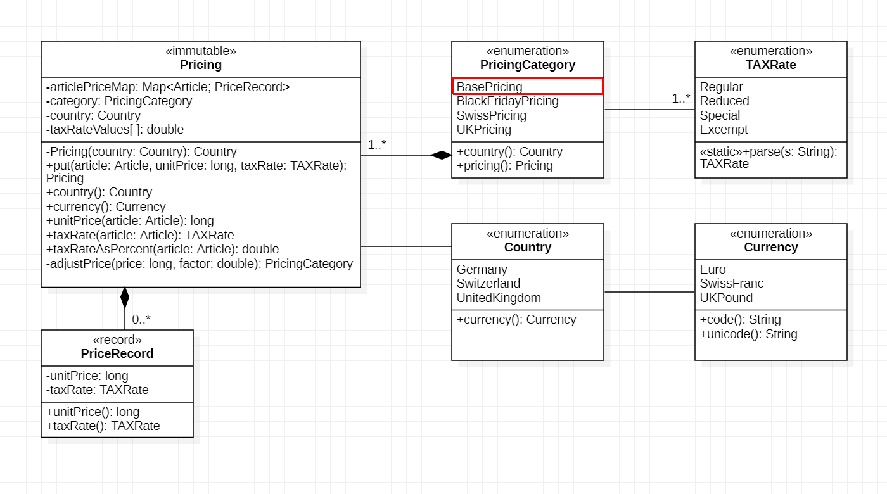

# D2: Extended *Pricing*

[D1: *DataModel*](.)

The current *Pricing* uses `BasePricing` as the only pricing model with
properties:

- *Country:* Germany,

- *Currency:* Euro and

- *VAT Tax rates:* regular: *19%* and reduced: *7%*.

Goal of this section is to extend *Pricing* with other models:

<table>
<td>Pricing Category<td>Country<td>Currency<td>VAT Tax Rates</tr>
<td>BasePricing<td>Germany<td>EUR<td>regular: 19%, reduced: 7%</tr>
<td>BlackFridayPricing<td>Germany<td>EUR<td>regular: 19%, reduced: 7%</tr>
<td>SwissPricing<td>Switzerland<td>CHF<td>regular: 8.1%, reduced: 2.6%, special: 3.8%</tr>
<td>UKPricing<td>United Kingdom<td>GBP<td>regular: 20%, reduced: 5%, excempt: 0%</tr>
<table>


Steps:

1. [Extend Class *Pricing*](#1-extend-class-pricing)
1. [Extend *articlePriceMap*](#2-extend-articlepricemap)
1. [Run Driver Code for Extended *Article* Tables](#3-run-driver-code-for-extended-article-tables)
1. [Commit and Push Changes](#4-commit-and-push-changes)


&nbsp;

## 1. Extend Class *Pricing*

The extended *Pricing* data model shows the new information.

Implement the extensions of the data model in class `Pricing.java`.




&nbsp;

## 2. Extend *articlePriceMap*

Actual article price information is stored in a map *articlePriceMap*
with an article used as a key and a *PriceRecord* containing the
price of one unit of the article and the applicable tax rate.

The *put()* - method of class *Pricing* stores and updates articles
with price records:

```java
/**
 * Record stored in {@link articlePriceMap} for an article.
 */
private record PriceRecord(long unitPrice, TAXRate taxRate) { }

/**
 * Map of articles with associated {@link PriceRecord}
 * (not exposed as getter).
 */
@Getter(AccessLevel.NONE)
private final Map<Article, PriceRecord> articlePriceMap = new HashMap<>();

/**
 * Store or update {@link Article} with new {@link PriceRecord} in
 * article price map.
 * @param article article to store or update in article price map
 * @param unitPrice price associated with one unit of the {@link Article}
 * @param taxRate tax rate applicable to {@link Article}
 * @return chainable self-reference
 */
public Pricing put(Article article, long unitPrice, TAXRate taxRate) {
    var priceRecord = new PriceRecord(unitPrice, taxRate);
    articlePriceMap.put(article, priceRecord);
    return this;
}
```

The *articlePriceMap* of `BlackFridayPricing` contains prices reduced by 20%
off the regular price.

When *DataFactory* creates a new article, it invoces the *put()* method for
`BasePricing` storing the article and price in its *articlePriceMap*.

In order to avoid filling *articlePriceMaps* for the other *Pricing* models,
the put() method should calculate estimates of adjusted prices by applying
a factor:

<table>
<td>Pricing Category<td>Factor<td>applied to prices in BasePricing</tr>
<td>BlackFridayPricing<td>0.8<td>20% off for Black Friday sales</tr>
<td>SwissPricing<td>1.8<td>elevated prices in CHF in Switzerland</tr>
<td>UKPricing<td>1.15<td>UK slightly elevated prices based on GBP/EUR exchange rate</tr>
<table>

When an article is put into the `BasePricing` *articlePriceMap*, the
*put()* method calculates adjusted prices and puts them into the
price maps of the other pricing categories.

Class *Pricing* contains a method for calculating price adjustments:

```java
/**
 * Adjust price to a factor, e.g. a currency exchange rate or a discount
 * rate. The adjustment is mapped to a trailing 5 or 9, e.g. price: 2497
 * is mapped to: 2499.
 * @param price price to adjust
 * @param factor exchange or discount rate
 * @return adjusted price
 */
private long adjustPrice(long price, double factor) {
    long newPrice = (long)(price * factor);
    long base = (newPrice / 10) * 10;
    long dig = (newPrice % 10 <= 5 && newPrice >= 20)? 5 : 9;
    return base + dig;
}
```

Implement pricing models by supplementing *enum* in `Pricing.java` with
the necessary extensions (Countries, Currencies).

*VAT TAXRates* can be handled by returning corresponding values by
*Pricing* method:

```java
/**
 * Return {@link TAXRate} as percent value for {@link Article}, e.g.
 * value 19.0 for tax rate of 19%.
 * @param article subject of tax rate request
 * @return tax rate as percent value that applies to article
 */
public double taxRateAsPercent(Article article) {
    return ...
}
```

Only class `Pricing.java` requires changes for the pricing extension. Other
classes of the code base require no change.


&nbsp;

## 3. Run Driver Code for Extended *Article* Tables

When all changes are implemented correctly, the driver class will print
article tables for all pricing categories:

```java
// build and print Article tables for different Pricings
Arrays.stream(PricingCategory.values())
    //
    // print article table for each Pricing category
    .forEach(category -> {
        // header: "Artikel (BasePricing, EUR):"
        var header = String.format("Artikel (%s, %s):\n", category, category.pricing().currency().code());
        StringBuilder sb2 = printArticles(articles.values().stream().toList(), category);
        System.out.println(sb2.insert(0, header).toString());
    });
```

Output of article tables with different pricings:

```
Artikel (BasePricing, EUR):
+----------+---------------------------------+---------------+-----------------+
|Artikel-ID| Beschreibung                    |      Preis EUR|   MwSt.Satz     |
+----------+---------------------------------+---------------+-----------------+
|SKU-663942| Fahrradhelm                     |     169.00 EUR|    19% normal   |
|SKU-425378| Buch 'UML'                      |      79.95 EUR|     7% reduziert|
|SKU-300926| Pfanne                          |      49.99 EUR|    19% normal   |
|SKU-278530| Buch 'Java'                     |      49.90 EUR|     7% reduziert|
|SKU-518957| Kanne                           |      19.99 EUR|    19% normal   |
|SKU-583978| Fahrradkarte                    |       6.95 EUR|     7% reduziert|
|SKU-638035| Teller                          |       6.49 EUR|    19% normal   |
|SKU-458362| Tasse                           |       2.99 EUR|    19% normal   |
|SKU-693856| Becher                          |       1.49 EUR|    19% normal   |
+----------+---------------------------------+---------------+-----------------+

Artikel (BlackFridayPricing, EUR):
+----------+---------------------------------+---------------+-----------------+
|Artikel-ID| Beschreibung                    |      Preis EUR|   MwSt.Satz     |
+----------+---------------------------------+---------------+-----------------+
|SKU-663942| Fahrradhelm                     |     135.25 EUR|    19% normal   |
|SKU-425378| Buch 'UML'                      |      63.99 EUR|     7% reduziert|
|SKU-300926| Pfanne                          |      39.99 EUR|    19% normal   |
|SKU-278530| Buch 'Java'                     |      39.95 EUR|     7% reduziert|
|SKU-518957| Kanne                           |      15.99 EUR|    19% normal   |
|SKU-583978| Fahrradkarte                    |       5.59 EUR|     7% reduziert|
|SKU-638035| Teller                          |       5.19 EUR|    19% normal   |
|SKU-458362| Tasse                           |       2.39 EUR|    19% normal   |
|SKU-693856| Becher                          |       1.19 EUR|    19% normal   |
+----------+---------------------------------+---------------+-----------------+

Artikel (SwissPricing, CHF):
+----------+---------------------------------+---------------+-----------------+
|Artikel-ID| Beschreibung                    |      Preis CHF|   MwSt.Satz     |
+----------+---------------------------------+---------------+-----------------+
|SKU-663942| Fahrradhelm                     |     304.25 CHF|   8.1% normal   |
|SKU-425378| Buch 'UML'                      |     143.95 CHF|   2.6% reduziert|
|SKU-300926| Pfanne                          |      89.99 CHF|   8.1% normal   |
|SKU-278530| Buch 'Java'                     |      89.85 CHF|   2.6% reduziert|
|SKU-518957| Kanne                           |      35.99 CHF|   8.1% normal   |
|SKU-583978| Fahrradkarte                    |      12.55 CHF|   2.6% reduziert|
|SKU-638035| Teller                          |      11.69 CHF|   8.1% normal   |
|SKU-458362| Tasse                           |       5.39 CHF|   8.1% normal   |
|SKU-693856| Becher                          |       2.69 CHF|   8.1% normal   |
+----------+---------------------------------+---------------+-----------------+

Artikel (UKPricing, GBP):
+----------+---------------------------------+---------------+-----------------+
|Artikel-ID| Beschreibung                    |      Preis GBP|   MwSt.Satz     |
+----------+---------------------------------+---------------+-----------------+
|SKU-663942| Fahrradhelm                     |     194.35 GBP|    20% normal   |
|SKU-425378| Buch 'UML'                      |      91.95 GBP|     5% reduziert|
|SKU-300926| Pfanne                          |      57.49 GBP|    20% normal   |
|SKU-278530| Buch 'Java'                     |      57.39 GBP|     5% reduziert|
|SKU-518957| Kanne                           |      22.99 GBP|    20% normal   |
|SKU-583978| Fahrradkarte                    |       7.99 GBP|     5% reduziert|
|SKU-638035| Teller                          |       7.49 GBP|    20% normal   |
|SKU-458362| Tasse                           |       3.45 GBP|    20% normal   |
|SKU-693856| Becher                          |       1.75 GBP|    20% normal   |
+----------+---------------------------------+---------------+-----------------+
```


&nbsp;

## 4. Commit and Push Changes

When all *JUnit* tests are passing, commit and push changes to your remote repository.

```sh
git commit -m "d2: extended Pricing"
git push                        # push new commit to your upstream remote repository
```
