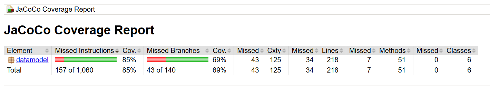
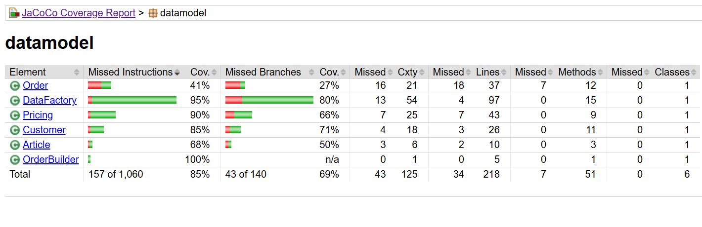
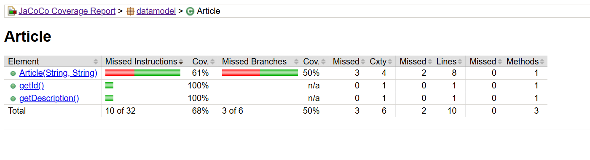
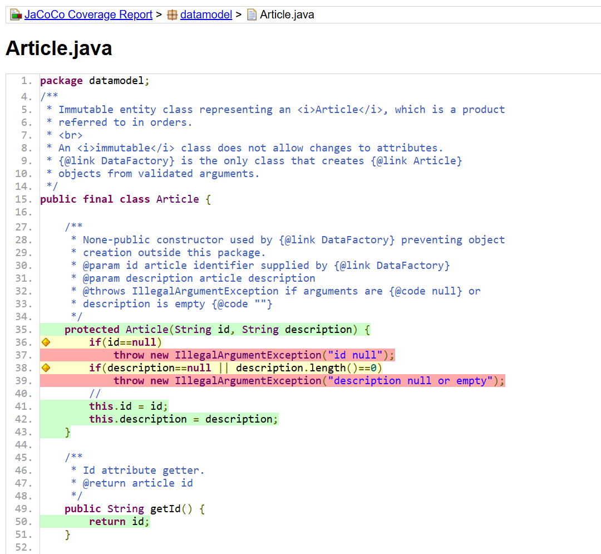
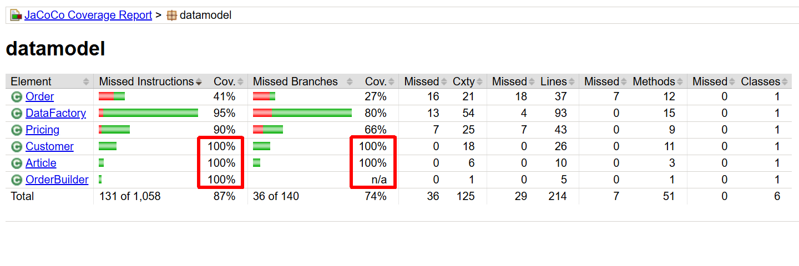

# E2: *Code Coverage Analysis*

[E1: *Order Table*](.)

<!-- 
https://stackoverflow.com/questions/17973067/how-to-use-jacoco-exec-report
https://stackoverflow.com/questions/40810496/jacoco-report-in-command-line

Jacoco agent and CLI:
- https://www.jacoco.org/jacoco/trunk/doc/agent.html
- https://www.jacoco.org/jacoco/trunk/doc/cli.html
-->

Goal of this assignment is to determine the *Code Coverage* of the `datamodel`
package.
*JUnit* *tests* exercise *tested code* (or *"units-under-test"*).
[*Code Coverage*](https://en.wikipedia.org/wiki/Code_coverage)
is a *metric of code quality* defined by the ratio of instructions executed
during *JUnit* tests and the total number of instructions in the code base.

*Code Coverage* of, e.g. 72% means that during execution of JUnit tests, 72% of
instructions of the tested code were executed (*covered*) at least once - 28% were
not executed (*not covered*).

Covering code does not mean it is correct - it simply means, it was executed
during JUnit tests while uncovered code was not.

In order to determine code coverage,
[*Code Coverage Tools*](https://en.wikipedia.org/wiki/Java_code_coverage_tools)
are used that exist for all programming languages such as
[*Jacoco*](https://www.jacoco.org) for *Java*,
[*Istanbul*](https://istanbul.js.org) for *JavaScript* or
[*Coverage.py*](https://coverage.readthedocs.io) for *Python*.

Determining code coverage consists of two steps (for *Jacoco*):

1. Step 1: is the *Recording* the execution of JUnit tests by the
    [*Jacoco-Agent*](https://www.jacoco.org/jacoco/trunk/doc/agent.html).
    The result of the recording is stored in a file: `jacoco.exec`
    in a new project directory: `coverage`.

1. Step 2: is the generation of a *Coverage Report* for selected classes
    (coverage of test-classes is not relevant, only tested classes are of interest).
    Reports are generated by a command using the
    [*Jacoco CLI*](https://www.jacoco.org/jacoco/trunk/doc/cli.html)
    (Command Line Interface).

    The report is generated as web page in *HTML*. Reports can also be generated
    in other formats such as *.csv* or *.xml* for further automated processing.

*Jacoco* `.jar` files have already been integrated in the `libs/jacoco` directory:

- `jacocoagent.jar` -- agent for recording the execution of instructions during
    JUnit tests.

- `jacococli.jar` -- for report generation.


Steps:

1. [Run JUnit Tests](#1-run-junit-tests)
1. [*Record* JUnit Test Execution](#2-record-junit-test-execution)
1. [Generate the *Coverage Report*](#3-generate-the-coverage-report)
1. [Improving *Code Coverage*](#4-improving-code-coverage)
1. [Commit and Push Changes](#5-commit-and-push-changes)


&nbsp;

## 1. Run JUnit Tests

Run all *JUnit* tests:

```sh
mk run-tests                        # run all JUnit tests
```
```
Test run finished after 542 ms
[       105 tests found           ]
[       105 tests successful      ]
[         0 tests failed          ]
done.
```

At this point, 105 tests should run sucessfully including:
[*Application_E12_Calculation_Tests.java*](Application_E12_Calculation_Tests.java).

See the full report: [*junit-tests-1.txt*](junit-tests-1.txt).


&nbsp;

## 2. *Record* JUnit Test Execution

In order to determine *code coverage* of those tests, test-execution must be recorded
as a first step. The *coverage report* is then generated from the recording in a second
step.

Generate the recording of the test run:

```sh
mk coverage                 # record test run in file: 'coverage/jacoco.exec'
```
```
java $(eval echo $JACOCO_AGENT) $(eval echo $JUNIT_CLASSPATH) \
  org.junit.platform.console.ConsoleLauncher $(eval echo $JUNIT_OPTIONS) \
  --scan-class-path; \
  echo coverage events recorded in: coverage/jacoco.exec

... output of test run

coverage events recorded in: coverage/jacoco.exec
done.
```

```sh
ls -la coverage             # show content of new directory: 'coverage'
```
```
total 40
drwxr-xr-x 1 svgr2 Kein     0 Dec  3 20:57 .
drwxr-xr-x 1 svgr2 Kein     0 Dec  3 20:57 ..
-rw-r--r-- 1 svgr2 Kein 34400 Dec  3 20:57 jacoco.exec      <-- recording
```


&nbsp;

## 3. Generate the *Coverage Report*

Generating the coverage report from the recording requires the selection
of classes for which the report will be created. Not all classes are of interest.

A shell-variable *ananlyze_classes* stores selected classes:

```sh
# define classes for which coverage report will be created
analyze_classes=(
    --classfiles ./bin/classes/datamodel/Article.class
    --classfiles ./bin/classes/datamodel/Customer.class
    --classfiles ./bin/classes/datamodel/DataFactory.class
    --classfiles ./bin/classes/datamodel/Order.class
    --classfiles ./bin/classes/datamodel/OrderBuilder.class
    --classfiles ./bin/classes/datamodel/Pricing.class
)

# create coverage report for selected classes
mk coverage-report
```
```
coverage_report; [ -f coverage/index.html ] && \
  echo coverage report created in: coverage/index.html
[INFO] Loading execution data file C:\Sven1\svgr2\workspaces\se1-bestellsystem\b
ranches\d12-datamodel\coverage\jacoco.exec.
[INFO] Analyzing 6 classes.
coverage report created in: coverage/index.html
done.
```

The coverage report is created in `coverage/index.html`, which can be opened
in a browser.

The [*hosted coverage report*](https://sgra64.github.io/se1-bestellsystem/e12-ordertable-coverage/index.html)
and images below show the current test coverage.

The *datamodel* package has an overall coverage of *85%* :



The breakdown into individual *datamodel* classes shows following code coverages:



The coverage of class *Article* overall is 68%. Individual methods *getId()* and
*getDescription()* are at *100%* - only the
constructor: `Article(String id, String description)` is at *68%*:



The reason are *"uncovered code paths"* in the construcor shown as red lines.
Cases of throwing *IllegalArgumentExceptions* have never been exercised during
JUnit tests.




&nbsp;

## 4. Improving *Code Coverage*

Improving *Code Coverage* can be achieved by:

- adding JUnit tests that exercise red-marked code paths or by

- removing red-marked code paths from tested code (potential *"dead code"*).

In this case, JUnit tests are added that exercise *"uncovered paths"*.

Add test class `Article_100_ConstructorCoverage_Tests.java` with methods for test cases:

1. `100:` - `test100_ArticleConstructor()` - regular cases of creating Article
    from constructor: `new Article("SKU-203954", "Kanne");`

1. `110:` - `test110_ArticleConstructorIdNull()` -
    test that an *IllegalArgumentException* is raised when the constructor
    is called with argument `id:` null. Test that exception message
    *"id null"* is passed with the exception.

1. `120:` - `test120_ArticleConstructorDescriptionNull()` -
    test that an *IllegalArgumentException* is raised when the constructor
    is called with argument `description:` null. Test that exception message
    *"description null or empty"* is passed with the exception.

1. `121:` - `test121_ArticleConstructorDescriptionEmpty()` -
    test that an *IllegalArgumentException* is raised when the constructor
    is called with an empty String for `description:`. Test that exception message
    *"description null or empty"* is passed with the exception.

Repeat the code coverage analysis.

```sh
mk coverage                         # run and record all JUnit tests
```

Now, 108 tests should run and pass (4 more over 105 tests above):

```
Test run finished after 542 ms
[       109 tests found           ]
[       109 tests successful      ]
[         0 tests failed          ]
done.
```
```sh
mk coverage-report                  # generate coverage report
```

Class *Article* should now be at *100%*.

Make classes *Customer* also achieve *100%*:




&nbsp;

## 5. Commit and Push Changes

With all tests passing, commit and push changes to your *"upstream"*
remote repository.

```sh
git commit -m "e2: datamodel, code coverage tests"
git push                        # push new commit to your upstream remote repository
```
