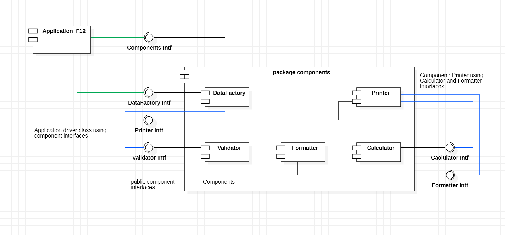
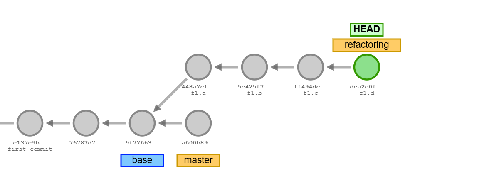
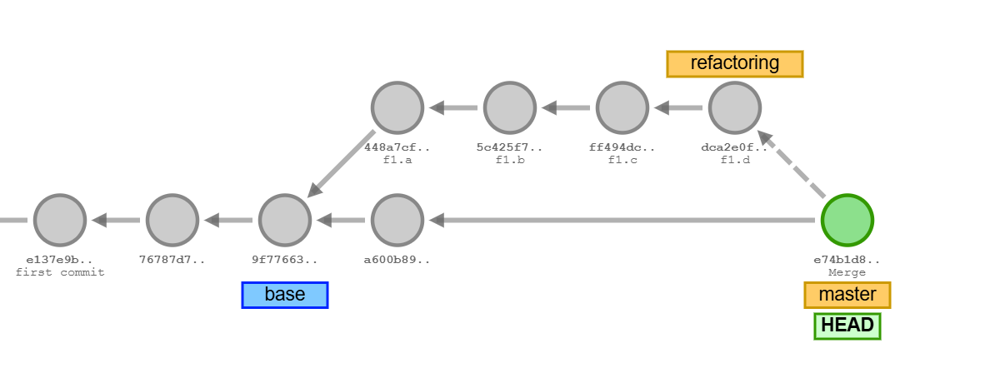

# F1: Refactoring: *Component Architecture*

[F2: Completing the Refactoring](README_F2.md)

<!-- 
git commit
git commit
git tag base
git checkout -b refactoring
git checkout master
git commit
git checkout refactoring
git commit -m "f1.a"
git commit -m "f1.b"
git commit -m "f1.c"
git commit -m "f1.d"
---
git checkout master
git merge refactoring
---
git checkout refactoring
git rebase master
---
git commit -m "f2.a"
git commit -m "f2.b"
git commit -m "f2.c"
---
git checkout master
git merge refactoring
---
git checkout refactoring
git rebase master
---
-->


[*Refactoring*](https://refactoring.com) is the systematic process of *improving code
structure* without changing or creating new functionality. No new features are added
or existing features are changed.
At the end of the *refactoring*, the same order table will be printed.

In [*Scrum*](https://www.scrum.org/resources/what-is-a-sprint-in-scrum),
software development is organized in one or two week *sprints*, either as:

- *feature sprints* with developing new features in the existing code structure or as

- *refactoring sprints* for improving the code structure without changing features.


### Problems of the Codebase

*Refactoring* should always have a clearly stated *goal*. Otherwise it is hard
to know whether code structure has improved.

The following problems have been identified in the current *se1-bestellsystem*
code base:

1. While *data model* classes (*Customer*, *Article*, *Order*, *Pricing*) are
    well organized, the code providing functionality lacks structure.

1. All functions (calculations, formattings, printing etc.) are methods in
    *Application_XXX.java* classes.

1. No overall software architecture has been defined. Code simply grew, which
    is not good practice.


### Goals of the *Refactoring*

The following improvements are expected from the refactoring:

1. Introduction of
    [*Component-based Software Architecture (CBA)*](https://configr.medium.com/component-based-architecture-building-scalable-maintainable-software-36137d56ff46)
    to organize code as *named components* (singleton objects with a clearly
    stated function and interface).

    *CBA* is a realization of patterns used in software architecture:

    - [*Single-Responsibility Principle*](https://blog.cleancoder.com/uncle-bob/2014/05/08/SingleReponsibilityPrinciple.html)
        (Robert Martin, 2014) and the principles of

    - [*Separartion of Concerns*](https://en.wikipedia.org/wiki/Separation_of_concerns)
        (Edsger W. Dijkstra, 1974) and

    - [*Information Hiding*]()
        (David Parnas, 1972)
        and [*Encapsulation*]()
        (Cox 1986, Gradcy Booch, James Rumbaugh, 1991) at the granularity of code modules (not just classes).

1. Components only expose *public interfaces*. Implementations are encapsulated 
    in non-public implementation classes.

1. Encapsulation of code modules as named components and exposing only interfaces
    has more advantages such as:

    - improved clarity, visible structure, simplification in the code base.

    - Only refererences to interfaces are proliferated through the code base,
        not references to implementations. Since interfaces are more stable
        (change less frequently than implementation code), importing code
        changes becomes more stable as well.

    - Cross-references (import relations) are reduced.

    - Impact of changes in implementations is reduced (while implementation code
        may change, importing code does not). Commit foot prints become smaller.

1. Centralized component object creation and explicit management of dependencies
    between components by
    [*Dependency Injection (DI)*](https://stackoverflow.com/questions/130794/what-is-dependency-injection)
    (*Martin Fowler, 2004:* *Inversion of Control Containers
    and the Dependency Injection pattern*, [*link*](https://martinfowler.com/articles/injection.html)).


Steps:

1. [*Component-based Software Architecture*](#1-component-based-software-architecture)
1. [Preparations](#2-preparations)
1. [New Branch *refactoring*](#3-new-branch-refactoring)
1. [New Package *Components*](#4-new-package-components)
1. [Component: *Calculator*](#5-component-calculator)
1. [Component Tests](#6-component-tests)
1. [Moving *DataFactory*](#7-moving-datafactory)


&nbsp;

## 1. *Component-based Software Architecture*

The diagram shows the new component-based architecture as
[*UML-Component diagramm*](https://www.uml-diagrams.org/component-diagrams.html):



The diagram shows following components:

- *Calculator:* for performing price and tax calculations.

- *DataFactory:* for creating objects of datamodel classes (*Customer*, *Article*, *Order*)
    from validated parameters.

- *Validator:* for validating parameters (e.g. names, contacts, etc.) for *DataFactory*.

- *Formatter:* for formatting prices, names and contacts.

- *Printer:* for outputting collections of *Customer*, *Article*, *Order* objects
    as tables.

- *Components:* a special component that holds (contains) the other component
    objects.

All components have:

- a public interface named after the component in a new package `components`.

- a non-public implementation class in a new package `components.impl` named
    after the component name appended by `Impl`.

For example, interface `Calculator.java` in package `components` provides the
public interface of the component. None-public implementation class
`CalculatorImpl.java` in package `components.impl` provides the implementation
of the component.

In assginment F1, the following components will be created:

```
public component interfaces:
- src/components/
- src/components/Calculator.java
- src/components/Components.java
- src/components/DataFactory.java

none-public implementation classes:
- src/components/impl
- src/components/impl/CalculatorImpl.java
- src/components/impl/ComponentsImpl.java
- src/components/impl/DataFactoryImpl.java
```


&nbsp;

## 2. Preparations

Before refactoring, test the current state of the code base. Starting from a broken base
is not adviced.

Perform the three standard tests:

1. Project build.

1. Run the program.

1. Run tests.

```sh
mk clean compile compile-tests

mk run

mk run-tests
```

Program output shows the order table from the previous assignment:

```
java application.Runtime
(5) Customer objects built.
(9) Article objects built.
(7) Order objects built.
---
Bestellungen:
+----------+-------------------------------------------------+-----------------+
|Bestell-ID| Bestellungen                     MwSt*     Preis|   MwSt    Gesamt|
+----------+-------------------------------------------------+-----------------+
|8592356245| Eric's Bestellung (in EUR):                     |                 |
|          |  - 4x Teller, 4x 6.49            4.14      25.96|                 |
|          |  - 8x Becher, 8x 1.49            1.90      11.92|                 |
|          |  - 1x Buch 'UML'                 5.23*     79.95|                 |
|          |  - 4x Tasse, 4x 2.99             1.91      11.96|  13.18    129.79|
+----------+-------------------------------------------------+-----------------+
|3563561357| Anne's Bestellung (in EUR):                     |                 |
|          |  - 2x Teller, 2x 6.49            2.07      12.98|                 |
|          |  - 2x Tasse, 2x 2.99             0.95       5.98|   3.02     18.96|
+----------+-------------------------------------------------+-----------------+
|5234968294| Eric's Bestellung (in EUR):                     |                 |
|          |  - 1x Kanne                      3.19      19.99|   3.19     19.99|
+----------+-------------------------------------------------+-----------------+
|6135735635| Nadine-Ulla's Best. (EUR):                      |                 |
|          |  - 12x Teller, 12x 6.49         12.43      77.88|                 |
|          |  - 1x Buch 'Java'                3.26*     49.90|                 |
|          |  - 1x Buch 'UML'                 5.23*     79.95|  20.92    207.73|
+----------+-------------------------------------------------+-----------------+
|6173043537| Khaled Saad's Best. (EUR):                      |                 |
|          |  - 1x Buch 'Java'                3.26*     49.90|                 |
|          |  - 1x Fahrradkarte               0.45*      6.95|   3.71     56.85|
+----------+-------------------------------------------------+-----------------+
|7372561535| Eric's Bestellung (in EUR):                     |                 |
|          |  - 1x Fahrradhelm               26.98     169.00|                 |
|          |  - 1x Fahrradkarte               0.45*      6.95|  27.43    175.95|
+----------+-------------------------------------------------+-----------------+
|4450305661| Eric's Bestellung (in EUR):                     |                 |
|          |  - 3x Tasse, 3x 2.99             1.43       8.97|                 |
|          |  - 3x Becher, 3x 1.49            0.71       4.47|                 |
|          |  - 1x Kanne                      3.19      19.99|   5.33     33.43|
+----------+-------------------------------------------------+-----------------+
                                                      Gesamt:|  76.78    642.70|
                                                             +=================+
```

Tests are passing:

```
Test run finished after 487 ms
[       115 tests found           ]
[       115 tests successful      ]
[         0 tests failed          ]
```


&nbsp;

## 3. New Branch *refactoring*

The refactoring will be performed on a separate branch `refactoring`, which
is a typical practice in software development.

Since *refactorings* are often complex imposing substantial changes in a
code base, the period while work is in progress will be shielded from the
main branch (and other branches).

Milestones of the refactoring are recorded as commits: `f1.a ... ` ... `f1.d ... `
on branch `refactoring` while the `main` branch remains unchanged: 



(use branch name `main` for `master`)


At the end, the state of the code base after the refactoring is recorded in
the last commit on branch `refactoring`.

When the refactored version is stable (works, goals have been achieved,
tests are passing), it is merged into the `main` branch:




Branches should be created off a *"clean project directory"*, which has no
uncommitted changes.

```sh
git status                      # show that project directory is "clean"
```
```
On branch refactoring
nothing to commit, working tree clean
```

If you find changes, commit or remove.

Next, a new branch `refactoring` is created:

```sh
git tag "base"                  # tag the commit on which the new branch 'refactoring' is based

git switch -c refactoring       # create new branch 'refactoring' and switch to the new branch

git branch                      # show branches ('*' marks the current branch)
```
```
  main                          ; main branch
* refactoring                   ; current branch (*) 'refactoring'
```

All further commits are recorded on the new branch `refactoring`.


&nbsp;

## 4. New Package *Components*

Create a new package `components` under `src` that includes the public interface of class `Components.java`:

```
<se1-bestellsystem>             # project directory
 |
 +-<src>
 |  +-<application>             # package with application driver classes
 |  |  +-- ...
 |  |  +--Application_E12.java
 |  |
 |  +-<datamodel>               # package with data model classes
 |  |  +-- ...
 |  |                       # *** NEW: ***
 |  +-<components>              # new package with public component interfaces
 |     +--Components.java       # public interface with Component getInstance() methods
 |     |
 |     +-<impl>                 # new package with non-public implementation classes
 |        +--ComponentsImpl.java    # implementation class of Components interface
```

The public interface of class `Components.java`:

```java
package components;

/**
 * Public interface with {@code getInstance()} methods for obtaining references
 * to component singleton objects.
 */
public interface Components {

    /**
     * Getter of {@link Components} implementation class singleton.
     * @return reference to singleton instance of {@link Components} implementation class
     */
    public static Components getInstance() {
        return components.impl.ComponentsImpl.getInstance();
    }
}
```

The interface only exposes a static `getInstance()` method through which a reference is passed
to a non-public (internal) implementation class called `ComponentsImpl.java`.

Only the interface `Components` is visible in the code base, not the internal implementation
class `ComponentsImpl.java` (residing in the package for implementation classes:
`components.impl`). Consequently, the return type of method `getInstance()` is
*Component*, not *ComponentImpl*.

Create class `ComponentsImpl.java` in a new inner package `components.impl` (see schema above):

```java
package components.impl;

import components.Calculator;
import components.Components;


/**
 * Implementation class of interface {@link Component} with {@code getInstance()}
 * methods for component singleton objects.
 * 
 * Class itself is a <i>singleton</i> object. It creates component singleton objects
 * and holds their references.
 */
public final class ComponentsImpl implements Components {

    /**
     * static singleton instance of class {@link ComponentImpl}
     */
    private static final Components instance = new ComponentsImpl();


    /**
     * Private constructor as part of the singleton pattern that creates
     * singleton instances of {@link Component} implementation classes.
     */
    private ComponentsImpl() { }

    /**
     * Getter of {@link Component} implementation class singleton.
     * @return reference to singleton instance of {@link CalComponent} implementation class
     */
    public static Components getInstance() {
        return instance;
    }
}
```

With both packages and classes added, code should compile.

Commit the first step of the refactoring to branch `refactoring`:

```sh
git status                      # show project status
```
```
On branch refactoring
Untracked files:
  (use "git add <file>..." to include in what will be committed)
        src/components/

nothing added to commit but untracked files present (use "git add" to track)
```

Stage and commit:

```sh
git add src/components          # stage new files under 'src/components'

# commit
git commit -m "f1.a interface Components.java, implementation class ComponentsImpl.java"
```
```
[refactoring 60b6451] f1.a interface Components.java, implementation class ComponentsImpl.java
 2 files changed, 46 insertions(+)
 create mode 100644 src/components/Components.java
 create mode 100644 src/components/impl/ComponentsImpl.java
```

Show the new commit:

```sh
git log --oneline               # show new commit
```

*HEAD* (git's pointer to record commits) points to the *refactoring* branch (-pointer)
where the new commit has been recorded. The *refactoring* branch (-pointer) remains
unchanged.

```
6cf6966 (HEAD -> refactoring) f1.a interface Components.java, implementation class ComponentsImpl.java
a5a9742 (main) Merge branch 'dev'
f2f933b e2: tests for 100% code coverage (Article.java, Customer.java)
971ea4f e1: OrderBuilder.java implementation
...
```


&nbsp;

## 5. Component: *Calculator*

Next, a component *Calculator* is added with public interface `Calculator.java` in
package `components` and a non-public implementation class `CalculatorImpl.java` in
package `components.impl`:

```
<se1-bestellsystem>             # project directory
 |
 +-<src>
 |  +-<components>              # new package with public component interfaces
 |     +--Components.java       # public interface with Component getInstance() methods
 |     +--Calculator.java       # public interface of Calculator component
 |     |
 |     +-<impl>                 # new package with non-public implementation classes
 |        +--ComponentsImpl.java    # implementation class of Components interface
 |        +--CalculatorImpl.java    # non-public implementation class of Calculator interface
```

Steps:

1. Create a public interface *Calculator.java* in package `components`.

1. Create a non-public implementation class *CalculatorImpl.java* in package `components.impl`.

1. Add a public method `Calculator getCalculator();` to *Components.java*.

1. Add the new method also to *ComponentsImpl.java* returning the reference to
    a new non-static, final variable `calculator` that is initialized in the
    constructor.

1. Add calculator methods to interface `Calculator`.

1. Change driver class `Application_E12.java` in package `application` to demonstrate
    the use of components.


Step 1:

Create a public interface *Calculator.java* in package `components`.

```java
package components;

/**
 * Interface of system component that performs price and VAT tax calculations.
 */
public interface Calculator {

}
```


Step 2:

Create a non-public implementation class *CalculatorImpl.java* in package `components.impl`:

```java
package components.impl;

/**
 * Non-public implementation class of {@link Calculator} interface of a
 * system component that performs price and VAT tax calculations.
 */
class CalculatorImpl implements Calculator {

}
```


Step 3:

Add a public method `Calculator getCalculator();` to interface *Components.java*:

```java
public interface Components {

    /**
     * Getter of {@link Calculator} component implementation class singleton.
     * @return reference to singleton instance of {@link Calculator} implementation class
     */
    public Calculator getCalculator();
}
```


Step 4:

Add the new method also to *ComponentsImpl.java* returning the reference to
a new non-static, final variable `calculator` that is initialized in the constructor:

```java
public final class ComponentsImpl implements Components {

    /**
     * singleton instance of {@link Calculator} implementation class
     */
    private final Calculator calculator;


    /**
     * Private constructor as part of the singleton pattern that creates
     * singleton instances of {@link Component} implementation classes.
     */
    private ComponentsImpl() {
        this.calculator = new CalculatorImpl();
    }

    /**
     * Getter of {@link Calculator} component implementation class singleton.
     * @return reference to singleton instance of {@link Calculator} implementation class
     */
    public Calculator getCalculator() {
        return calculator;
    }
}
```


Step 5:

Add calculator methods to interface `Calculator`. Methods are currently included in
the driver class *Application_E12.java* in package *application* from the previous
assignment.

```sh
grep public src/application/Application_E12.java
```

The listing shows methods starting with `long calculate(...)`.

```
public class Application_E12 implements Runtime.Runnable {
    public Application_E12() { }
    public void run(Properties properties, String[] args) {
    public Optional<Customer> findCustomerBySpec(String customerSpec) {
    public Optional<Article> findArticleBySpec(String articleSpec) {
    public StringBuilder printOrders(Collection<Order> orders) {
---
    public long calculateIncludedVAT(long grossValue, double taxRate) {
    public long calculateOrderItemValue(OrderItem item, Pricing pricing) {
    public long calculateOrderItemVAT(OrderItem item, Pricing pricing) {
    public long calculateOrderValue(Order order) {
    public long calculateOrderVAT(Order order) {
---
    public String fmtPrice(long price, Pricing.Currency currency, int... style) {
    public String fmtDecimal(long value, int decimalDigits, String... unit) {
```

Carry `long calculate(...)` methods (with Javadocs) over to the interface `Calculator`.

Add implementations to the implementation class `CalculatorImpl.java`.

Component *Calculator* has now been finished. Code from the prior driver class
`Application_E12.java` has been moved into a new component `Calculator`.


Step 6:

Extend the driver class `Application_E12.java` in package `application` to demonstrate
the use of components:

```java
/**
 * Driver class for the <i>e12-ordertable</i> assignment. Class creates
 * {@link Customer}, {@link Article} and {@link Order} objects and prints
 * tables of objects.
 * <br>
 * Class implements the {@link Runtime.Runnable} interface.
 * 
 * @version <code style=color:green>{@value application.package_info#Version}</code>
 * @author <code style=color:blue>{@value application.package_info#Author}</code>
 */
@Bean(priority=12)
public class Application_E12 implements Runtime.Runnable {

    @Override
    public void run(Properties properties, String[] args) {

        ...

        /*
         * add at the end of run()-method:
         */
        System.out.println("Application_F12, using components:");
        //
        Components components = Components.getInstance();
        Calculator calculator = components.getCalculator();
        //
        long price = 10000L;    // 100.00 EUR
        long vat = calculator.calculateIncludedVAT(price, 19.0);
        System.out.println(String.format("19%s enthaltene MwSt. in %d.%02d EUR sind %d.%02d EUR.",
            "%", price/100, price%100, vat/100, vat%100));
    }
}
```

Run the code:

```
 ...
 ...
+----------+-------------------------------------------------+-----------------+
                                                      Gesamt:|  76.78    642.70|
                                                             +=================+
Application_F12, use of components:
19% enthaltene MwSt. in 100.00 EUR sind 15.97 EUR.
```

Commit this step to the branch `refactoring`:

```sh
git add src                     # stage new files under 'src'
git status                      # show staged files
```
```
On branch refactoring
Changes to be committed:
  (use "git restore --staged <file>..." to unstage)
        new file:   src/components/Calculator.java
        modified:   src/components/Components.java
        new file:   src/components/impl/CalculatorImpl.java
        modified:   src/components/impl/ComponentsImpl.java
```

```sh
# commit
git commit -m "f1.b add Calculator component"
```
```
[refactoring 457c9c2] f1.b add Calculator component
 5 files changed, 245 insertions(+), 2 deletions(-)
 create mode 100644 src/components/Calculator.java
 create mode 100644 src/components/impl/CalculatorImpl.java
```

The new commit `f1.b` has been appended to the prior commit `f1.a`:

```sh
git log --oneline               # show new commit
```
```
457c9c2 (HEAD -> refactoring) f1.b add Calculator component
6cf6966 f1.a interface Components.java, implementation class ComponentsImpl.java
a5a9742 (main) Merge branch 'dev'
f2f933b e2: tests for 100% code coverage (Article.java, Customer.java)
971ea4f e1: OrderBuilder.java implementation
...
```


&nbsp;

## 6. Component Tests

Component tests are placed in package `components` under `tests`:

```
 |
 +-<tests>
 |  +-<application>             # package with application tests
 |  |  +--Application_0_always_pass_Tests.java
 |  |
 |  +-<datamodel>               # package with data model test classes
 |  |  +-- ...
 |  |
 |  +-<components>              # new package with component test classes
 |     +--Components_Tests.java
 |     +--Calculator_Tests.java
```

Add new test class `Component_Tests.java` to package `tests/components`:

```java
package components;

import org.junit.jupiter.api.*;

import static org.junit.jupiter.api.Assertions.*;

/**
 * Test class to test the JUnit test setup. @Test methods of this class
 * always pass. If JUnit is setup properly, tests should run in the IDE
 * and in the terminal.
 */
@TestMethodOrder(MethodOrderer.OrderAnnotation.class)
public class Component_Tests {

    @Test
    @Order(100)
    void test_100_getInstance() {
        var instance = Components.getInstance();
        assertNotNull(instance);
        assertTrue(Components.class.isAssignableFrom(instance.getClass()));
        //
        var instance_2 = Components.getInstance();
        assertNotNull(instance_2);
        assertTrue(Components.class.isAssignableFrom(instance_2.getClass()));
        //
        assertEquals(instance, instance_2);
    }


    @Test
    @Order(200)
    void test_200_getCalculator() {
        var system = Components.getInstance();
        assertNotNull(system);
        //
        var calculator = system.getCalculator();
        assertNotNull(calculator);
        assertTrue(Calculator.class.isAssignableFrom(calculator.getClass()));
        //
        var calculator_2 = system.getCalculator();
        assertNotNull(calculator_2);
        assertTrue(Calculator.class.isAssignableFrom(calculator_2.getClass()));
        //
        assertEquals(calculator, calculator_2);
    }
}
```

Add new test class [*Calculator_Tests.java*](Calculator_Tests.java)
to package `tests/components`.

Tests have been refactored from prior test class
[*Application_E12_Calculation_Tests.java*](https://github.com/sgra64/se1-bestellsystem/blob/markup/e12-ordertable/Application_E12_Calculation_Tests.java).

Remove *Application_E12_Calculation_Tests.java* from the project and add
[Calculator_Tests.java](Calculator_Tests.java) instead to package `tests/components`:

Two new test classes should be present for components:

```sh
find tests/components
```
```
tests/components
tests/components/Calculator_Tests.java
tests/components/Component_Tests.java
```

Run tests:

```sh
java $(eval echo $JUNIT_CLASSPATH) org.junit.platform.console.ConsoleLauncher\
  $(eval echo $JUNIT_OPTIONS) \
  -c components.Component_Tests \
  -c components.Calculator_Tests
```
```
├─ JUnit Jupiter ✔
│  ├─ Component_Tests ✔
│  │  ├─ test_100_getInstance() ✔
│  │  └─ test_200_getCalculator() ✔
│  └─ Calculator_Tests ✔
│     ├─ test_100_calculateIncludedVAT_regular() ✔
│     ├─ test_110_calculateIncludedVAT_rounding_tests() ✔
│     ├─ test_120_calculateIncludedVAT_corner_cases_tests() ✔
│     ├─ test_130_calculateIncludedVAT_bulk_19pct_tests() ✔
│     ├─ test_131_calculateIncludedVAT_bulk_7pct_tests() ✔
│     ├─ test_200_calculateOrderItemValue_tests() ✔
│     ├─ test_210_calculateOrderItemValue_SwissPricing_tests() ✔
│     ├─ test_300_calculateOrderItemVAT_tests() ✔
│     ├─ test_310_calculateOrderItemVAT_SwissPricing_tests() ✔
│     ├─ test_400_calculateOrderValue_tests() ✔
│     ├─ test_410_calculateOrderValue_SwissPricing_tests() ✔
│     ├─ test_500_calculateOrderVAT_tests() ✔
│     └─ test_510_calculateOrderVAT_SwissPricing_tests() ✔
├─ JUnit Vintage ✔
└─ JUnit Platform Suite ✔

Test run finished after 219 ms
[        15 tests found           ]
[        15 tests successful      ]
[         0 tests failed          ]
```

Commit component tests to the 'refactoring' branch:

```sh
git add .                       # stage new test files
git status                      # show staged files
```
```
On branch refactoring
Changes to be committed:
  (use "git restore --staged <file>..." to unstage)
        renamed:    tests/application/Application_E12_Calculation_Tests.java ->
tests/components/Calculator_Tests.java
        new file:   tests/components/Component_Tests.java
```

```sh
# commit
git commit -m "f1.c component tests, Component_Tests.java, Calculator_Tests.java"
```
```
[refactoring 024cff9] f1.c component tests, Component_Tests.java, Calculator_Tests.java
 2 files changed, 50 insertions(+), 2 deletions(-)
 rename tests/{application/Application_E12_Calculation_Tests.java => components/Calculator_Tests.java} (99%)
 create mode 100644 tests/components/Component_Tests.java
```

The new commit `f1.c` has been added on top of prior commit `f1.b`:

```sh
git log --oneline               # show new commit
```

Branch *refactoring* has now three commits (*f1.a*, *f1.b*, *f1.c* ) after the *main* branch:

```
b9d41b5 (HEAD -> refactoring) f1.c component tests, Component_Tests.java, Calculator_Tests.java
457c9c2 f1.b add Calculator component
6cf6966 f1.a interface Components.java, implementation class ComponentsImpl.java
a5a9742 (main) Merge branch 'dev'       <-- main branch
f2f933b e2: tests for 100% code coverage (Article.java, Customer.java)
971ea4f e1: OrderBuilder.java implementation
...
```


&nbsp;

## 7. Moving *DataFactory*

Classes *DataFactory* and *OrderBuilder* are currently located in package `datamodel`.
They will be combined to a new component: `DataFactory` in package `components`.

Use your IDE's refactoring (move file) function to move both classes from package `datamodel`
to the package `components` (in VSCode: drag-and-drop files).
*"Refactoring"* IDE's often means renaming or moving things and adjusting code
accordingly, e.g. by adjusting `package` and `import` statements.

After the move, fix compile errors:

- in classes *DataFactory* and *OrderBuilder*, add imports to now distant *datamodel* classes:
    ```java
    import datamodel.Customer;
    import datamodel.Article;
    import datamodel.Order;
    ```

- export package *components* in *module-info.java*:
    ```java
    opens components;
    exports components;
    ```

- class *DataFactory* shows errors in *new Customer*, *new Article* and *new Order*
    statements because constructors of these classes have been restricted to *protected*
    to ensure the creation of datamodel objets through *DataFactory* from valid arguments only.

    Since class *DataFactory* is no longer in package *datamodel*, it can no longer invode
    constructors with *new* directly. To solve the problem, a local proxy class is
    introduced in package *datamodel* that create objects, but is restricted to be used
    by class *DataFactory* only. Java does not provide a mechanism to grant access to
    individual classes (unlike C++ that has a *friend* declaration).
    In Java, a workaround is needed.

    Install class [*ProtectedFactory.java*](ProtectedFactory.java) in package *datamodel*.

    The class provides creator functions that create objects of *datamodel* classes.
    Since it is in the same package, it can invoke protected constructors.

    Creator functions are only passed (injected) to class *DataFactory*. No other class
    can gain access to creator functions:

    ```java
    package datamodel;

    import java.time.LocalDateTime;
    import components.DataFactory;

    /**
    * Factory class that injects creator functions of datamodel classes only to
    * {@link DataFactory} in a protected way just after {@link DataFactory} itself
    * has been created and the {@code inject()} method has been called.
    * Class has no effect after this first invocation.
    * <br>
    * Datamodel classes have protected constructors and are not allowed to be
    * created through {@code new} from outside this package with the exception
    * of the {@link DataFactory} component providing the only means of creating
    * datamodel objects from validated arguments. {@link DataFactory} requires
    * a facility in package {@link datamodel} to invoke protected constructors,
    * which is provided via creator functions.
    */
    public final class ProtectedFactory {

        /**
        * Definition of lambda function to create a {@link Customer} object.
        */
        @FunctionalInterface
        public interface CustomerCreator {
            Customer createCustomer(long id, String firstName, String lastName);
        }

        /**
        * Definition of lambda function to create an {@link Article} object.
        */
        @FunctionalInterface
        public interface ArticleCreator {
            Article createArticle(String id, String description);
        }

        /**
        * Definition of lambda function to create an {@link Order} object.
        */
        @FunctionalInterface
        public interface OrderCreator {
            Order createOrder(long id, Customer customer, Pricing pricing, LocalDateTime created);
        }

        /**
        * Definition of lambda function to inject creator functions upon firts invocation.
        */
        @FunctionalInterface
        public interface Injector {
            void inject(CustomerCreator customerCreator, ArticleCreator articleCreator, OrderCreator orderCreator);
        }

        /**
        * Flag to indicate first invocation.
        */
        private static boolean firstCall = true;


        /**
        * Private constructor to prevent object instantiation. Cconstructor is never called
        * (example of "dead code with purpose").
        */
        private ProtectedFactory() { }

        /**
        * Static accessor method to {@link ProtectedFactory} <i>singleton</i> instance.
        * Function only injects creator functions upon first invocation, which occurs when
        * {@link DataFactory} instance is created.
        * @param datafactory reference to {@link DataFactory} to inject creator functions
        * @param injector injector to which creator functions are injected upon first invocation
        */
        public static void inject(DataFactory datafactory, Injector injector) {
            if(firstCall && datafactory != null && injector != null) {
                firstCall = false;
                injector.inject(
                    (id, firstName, lastName) -> new Customer(id, firstName, lastName),
                    (id, description) -> new Article(id, description),
                    (id, customer, pricing, created) -> new Order(id, customer, pricing, created)
                );
            }
        }
    }
    ```

- Change class *DataFactory* to allow injection of creator functions.
    Adjust the creation of *datamodel* objects. The example is given in the
    *createCustomer()* method (replace invocation of *new* with creator function):

    ```java
    public class DataFactory {

        /**
         * Static {@link DataFactory} <i>Singleton</i> instance (<i>lazy</i> pattern).
         */
        private static DataFactory dataFactory = null;

        /**
         * Creator functions injected by {@link ProtectedFactory}
         */
        private Optional<CustomerCreator> customerCreator = Optional.empty();
        private Optional<ArticleCreator> articleCreator = Optional.empty();
        private Optional<OrderCreator> orderCreator = Optional.empty();


        /**
         * Static accessor method to {@link DataFactory} <i>Singleton</i> instance.
         * @return singleton {@link DataFactory} instance
         */
        public static DataFactory getInstance() {
            if(dataFactory==null) {
                dataFactory = new DataFactory();
                ProtectedFactory.inject(dataFactory, (c, a, o) -> {
                    dataFactory.customerCreator = Optional.of(c);
                    dataFactory.articleCreator = Optional.of(a);
                    dataFactory.orderCreator = Optional.of(o);
                });
            }
            return dataFactory;
        }

        /*
        * <i>Factory</i> method to create an object of class {@link Customer}
        * from validated parameters.
        * 
        * Replace constructor invocation with calling the creator function:
        */
        public Optional<Customer> createCustomer(String name, String contact) {
            var nameParts = validateSplitName(name);
            if(nameParts.isPresent()) {
                long id = customerIdPool.next();
                var validContact = validateContact(contact);
                if(validContact.isPresent()) {
                    // only create Customer when all conditions are met
                    // 
                    // replace constructor invocation with calling the creator function:
                    // Customer c = new Customer(id, nameParts.get().first(), nameParts.get().last());
                    if(customerCreator.isPresent()) {
                        Customer c = customerCreator.get().createCustomer(id, nameParts.get().first(), nameParts.get().last());
                        c.addContact(validContact.get());
                        return Optional.of(c);
                    }
                }
            }
            return Optional.empty();
        }
    }
    ```

    Replace constructor calls in class *DataFactory* also for *new Article* and *new Order*.

All classes should now compile. Make sure tests compile (IDE Refactoring may have inserted
`import datamodel.Order` into code colliding with JUnit's `@Order` annotation. Remove these
imports).

Run the code. The order table should occur as before.

Run tests. All tests should pass.

Stage changes:

```sh
git add .                   # stage for commit

git status                  # show staged files
```
```
On branch refactoring
Changes to be committed:
(use "git restore --staged <file>..." to unstage)
    modified:   src/application/Application_C4.java
    modified:   src/application/Application_D12.java
    modified:   src/application/Application_E12.java
    modified:   src/components/Calculator.java
    renamed:    src/datamodel/DataFactory.java -> src/components/DataFactory.java
    renamed:    src/datamodel/OrderBuilder.java -> src/components/OrderBuilder.java
    modified:   src/components/impl/CalculatorImpl.java
    modified:   src/datamodel/Article.java
    modified:   src/datamodel/Customer.java
    modified:   src/datamodel/Order.java
    new file:   src/datamodel/ProtectedFactory.java
    modified:   src/module-info.java
    modified:   tests/components/Calculator_Tests.java
    modified:   tests/datamodel/Article_100_FactoryCreate_Tests.java
    modified:   tests/datamodel/Article_200_Id_Tests.java
    modified:   tests/datamodel/Article_300_Description_Tests.java
    modified:   tests/datamodel/Article_400_Price_Tests.java
    modified:   tests/datamodel/Article_500_PriceVAT_Tests.java
    modified:   tests/datamodel/Customer_100_FactoryCreate_Tests.java
    modified:   tests/datamodel/Customer_200_Id_Tests.java
    modified:   tests/datamodel/Customer_300_Name_Tests.java
    modified:   tests/datamodel/Customer_400_Contacts_Tests.java
    modified:   tests/datamodel/Customer_500_NameXXL_Tests.java
```

Commit on branch `refactoring` with message:
`"f1.d DataFactory, OrderBuilder moved from package 'datamodel' to package 'components'"`

```
[refactoring a63c9c2] f1.d DataFactory, OrderBuilder moved from package 'datamodel' to package 'components'
  23 files changed, 160 insertions(+), 19 deletions(-)
  rename src/{datamodel => components}/DataFactory.java (90%)
  rename src/{datamodel => components}/OrderBuilder.java (97%)
  create mode 100644 src/datamodel/ProtectedFactory.java
```

The *"commit footprint"* of moving two classes *DataFactory* and *OrderBuilder*
from package datamodel to package components is quite substantial affecting 23 files,
mainly caused by insertion of new `import components.DataFactory` statements. 

```sh
git diff --name-status HEAD HEAD~1      # show the difference between the two last commits

git diff HEAD HEAD~1 > all_diffs        # list difference in all files and output to file 'all_diffs'
```

At this stage of the refactoring, the code performs exactly the same function as before
the refactoring: printing the order table.

Show the entire commit history of branch *refactoring:*

```sh
git log --oneline                       # show commit history
```

The history shows commits `f1.a` ... `f1.d`

```
0a85d0f (HEAD -> refactoring) f1.d DataFactory, OrderBuilder moved from package 'datamodel' to package 'components'
50946a5 f1.c component tests, Component_Tests.java, Calculator_Tests.java
103b66c f1.b add Calculator component
ee79a73 f1.a interface Components.java, implementation class ComponentsImpl.java
de4630a (tag: base, main) Merge branch 'dev'
```

Switching to branch *main* makes refactoring changes disappear from the project
directory, which is set back to the state before the refactoring.

```sh
git switch main                         # switch to branch main

git log --oneline                       # show commit history

find src                                # list sources
```

Packages `components` and `components.impl` have disappeared.

Switch back to branch *refactoring* 

```sh
git switch refactoring                  # switch back to branch refactoring

git log --oneline                       # show commit history

find src                                # list sources
```

Packages `components` and `components.impl` are back.

Rebuild the project and run tests.

```sh
mk clean compile compile-tests run-tests
```
```
Test run finished after 598 ms     
 ...
[       117 tests found           ]
[       117 tests successful      ]
[         0 tests failed          ]
done.
```

Run the application to verify the order table still prints properly.

```sh
mk run
```
```
java application.Runtime
(5) Customer objects built.
(9) Article objects built.
(7) Order objects built.
---
Bestellungen:
+----------+-------------------------------------------------+-----------------+
|Bestell-ID| Bestellungen                     MwSt*     Preis|   MwSt    Gesamt|
+----------+-------------------------------------------------+-----------------+
|8592356245| Eric's Bestellung (in EUR):                     |                 |
|          |  - 4x Teller, 4x 6.49            4.14      25.96|                 |
|          |  - 8x Becher, 8x 1.49            1.90      11.92|                 |
|          |  - 1x Buch 'UML'                 5.23*     79.95|                 |
|          |  - 4x Tasse, 4x 2.99             1.91      11.96|  13.18    129.79|
+----------+-------------------------------------------------+-----------------+
|3563561357| Anne's Bestellung (in EUR):                     |                 |
|          |  - 2x Teller, 2x 6.49            2.07      12.98|                 |
|          |  - 2x Tasse, 2x 2.99             0.95       5.98|   3.02     18.96|
+----------+-------------------------------------------------+-----------------+
|5234968294| Eric's Bestellung (in EUR):                     |                 |
|          |  - 1x Kanne                      3.19      19.99|   3.19     19.99|
+----------+-------------------------------------------------+-----------------+
|6135735635| Nadine-Ulla's Best. (EUR):                      |                 |
|          |  - 12x Teller, 12x 6.49         12.43      77.88|                 |
|          |  - 1x Buch 'Java'                3.26*     49.90|                 |
|          |  - 1x Buch 'UML'                 5.23*     79.95|  20.92    207.73|
+----------+-------------------------------------------------+-----------------+
|6173043537| Khaled Saad's Best. (EUR):                      |                 |
|          |  - 1x Buch 'Java'                3.26*     49.90|                 |
|          |  - 1x Fahrradkarte               0.45*      6.95|   3.71     56.85|
+----------+-------------------------------------------------+-----------------+
|7372561535| Eric's Bestellung (in EUR):                     |                 |
|          |  - 1x Fahrradhelm               26.98     169.00|                 |
|          |  - 1x Fahrradkarte               0.45*      6.95|  27.43    175.95|
+----------+-------------------------------------------------+-----------------+
|4450305661| Eric's Bestellung (in EUR):                     |                 |
|          |  - 3x Tasse, 3x 2.99             1.43       8.97|                 |
|          |  - 3x Becher, 3x 1.49            0.71       4.47|                 |
|          |  - 1x Kanne                      3.19      19.99|   5.33     33.43|
+----------+-------------------------------------------------+-----------------+
                                                      Gesamt:|  76.78    642.70|
                                                             +=================+
```

We have now reached the state of the refactoring with four commits recorded
on branch `refactoring`:


